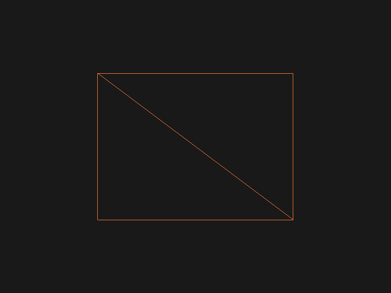
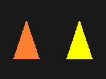
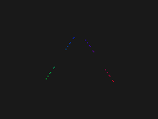

<div
    style="width: auto; text-align: center; margin: 0 auto; padding: 0"
>
    <h1 align="center">start-learning-opengl</h1>
    <h4 align="center">
        <span>
            <a href="https://learnopengl-cn.github.io/"
                >learnopengl-cn</a
            >
            学习示例 --> IDE:vscode
        </span>
    </h4>
    <h2 align="center">example screenshot</h2>
    <div align="center">
     <div style="margin: 20px">
            <a
                style="margin: 10px"
                href="./src/02_hello_triangle/"
                title="02_hello_triangle"
                ></a>
            <a
                style="margin: 10px"
                href="./src/02_hello_triangle/"
                title="02_hello_triangle"
                ></a>
            <a
                style="margin: 10px"
                href="./src/03_hello_triangle_exercise/"
                title="03_hello_triangle_exercise"
                ></a>
            <a
                style="margin: 10px"
                href="./src/04_shader_glsl/"
                title="04_shader_glsl_01"
                ></a>
            <a
                style="margin: 10px"
                href="./src/04_shader_glsl/"
                title="04_shader_glsl_02"
                ></a>
            <a
                style="margin: 10px"
                href="./src/04_shader_glsl/"
                title="05_shader_class"
                ></a>
        </div>
        <div style="margin: 20px">
            <a
                style="margin: 10px"
                href="./src/02_hello_triangle/"
                title="02_hello_triangle"
                ></a>
            <a
                style="margin: 10px"
                href="./src/02_hello_triangle/"
                title="02_hello_triangle"
                ></a>
            <a
                style="margin: 10px"
                href="./src/03_hello_triangle_exercise/"
                title="03_hello_triangle_exercise"
                ></a>
            <a
                style="margin: 10px"
                href="./src/04_shader_glsl/"
                title="04_shader_glsl_01"
                ></a>
            <a
                style="margin: 10px"
                href="./src/04_shader_glsl/"
                title="04_shader_glsl_02"
                ></a>
            <a
                style="margin: 10px"
                href="./src/04_shader_glsl/"
                title="05_shader_class"
                ></a>
        </div>
    </div>
</div>

<div>
    <h1 align="center"> windows 下 vscode 配置 OpenGL 开发环境
    </h1>
</div>

## 参考

-   windows 需安装 MinGW, install gcc、g++、gdb 和 mingw32-make 并 进入到 `MinGW\bin` 文件夹下 把 mingw32-make.exe 修改成 make.exe

    > [MinGW](https://sourceforge.net/projects/mingw/) 不要下载 *MinGW-w64*因为后面可能会出现问题
    > MinGW，即 Minimalist GNU For Windows。它是一些头文件和端口库的集合，该集合允许人们在没有第三方动态链接库的情况下使用 GCC 产生 Win32 程序。

-   vscode 插件 [`C/C++`](https://marketplace.visualstudio.com/items?itemName=ms-vscode.cpptools)、[`C/C++ Project Generator`](https://marketplace.visualstudio.com/items?itemName=danielpinto8zz6.c-cpp-project-generator)

-   glfw 下载 [`Windows pre-compiled binaries`](https://www.glfw.org/download.html)

    > 选择**Windows pre-compiled binaries**，因为我们使用的 MinGW 所以选择 [32-bit Windows binaries](https://github.com/glfw/glfw/releases/download/3.3.4/glfw-3.3.4.bin.WIN32.zip)

-   glad [在线服务](https://glad.dav1d.de/) 生成静态库
    ```
    > gcc ./src/glad.c -c -I ./include/ // 生成 .o文件
    > ar -rc libglad.a glad.o           // 生成我们所需要的 .a文件
    ```
    > 将生成的 libglad.a 复制到 lib 文件下
-   glm 复制到 include 目录下

-   imgui 复制到 include 目下,Makefile 中添加以下命令
    ```mk
    # define the C source files
    SOURCES		:= $(wildcard $(patsubst %,%/*.cpp, $(SOURCEDIRS)))
    SOURCES	+= include/imgui/imgui_impl_glfw.cpp include/imgui/imgui_impl_opengl3.cpp
    SOURCES	+= include/imgui/imgui.cpp include/imgui/imgui_demo.cpp include/imgui/imgui_draw.cpp include/imgui/imgui_widgets.cpp
    ```
-   assimp 下载已编译好的文件 [Assimp3-1-1_MinGW4-8-1_Win32.zip](https://www.mediafire.com/file/jjiv41rv8euy3dt/Assimp3-1-1_MinGW4-8-1_Win32.zip/file)

-   [参考 Makefile 文件](https://github.com/yocover/start-learning-opengl/blob/main/Makefile)

## 示例

### 1. Run 和 Clean

**测试代码**

```c++
#include <glad/glad.h>
#include <GLFW/glfw3.h>

#include <iostream>

void framebuffer_size_callback(GLFWwindow *window, int width, int height);
void processInput(GLFWwindow *window);

const unsigned int SCR_WIDTH = 800;
const unsigned int SCR_HEIGHT = 600;

int main()
{
	glfwInit();
	glfwWindowHint(GLFW_CONTEXT_VERSION_MAJOR, 3);
	glfwWindowHint(GLFW_CONTEXT_VERSION_MINOR, 3);
	glfwWindowHint(GLFW_OPENGL_PROFILE, GLFW_OPENGL_CORE_PROFILE);

	GLFWwindow *window = glfwCreateWindow(SCR_WIDTH, SCR_HEIGHT, "LearnOpenGL", NULL, NULL);
	if (window == NULL)
	{
		std::cout << "Failed to create GLFW window" << std::endl;
		glfwTerminate();
		return -1;
	}
	glfwMakeContextCurrent(window);
	glfwSetFramebufferSizeCallback(window, framebuffer_size_callback);

	if (!gladLoadGLLoader((GLADloadproc)glfwGetProcAddress))
	{
		std::cout << "Failed to initialize GLAD" << std::endl;
		return -1;
	}

	while (!glfwWindowShouldClose(window))
	{
		processInput(window);
		glfwSwapBuffers(window);
		glfwPollEvents();
	}

	glfwTerminate();
	return 0;
}

void processInput(GLFWwindow *window)
{
	if (glfwGetKey(window, GLFW_KEY_ESCAPE) == GLFW_PRESS)
		glfwSetWindowShouldClose(window, true);
}

void framebuffer_size_callback(GLFWwindow *window, int width, int height)
{
	glViewport(0, 0, width, height);
}
```

**执行命令 run 编译和运行.exe 程序**

```Bash
make run dir=01_test_glfw
```

**执行命令 clean 删除 .exe 和对应文件夹下的.o 文件**

```Bash
make clean dir=01_test_glfw
```

### 2. Debug

需要设置调试一个文件 修改 `tasks.json`下面的条目

```js
 "label": "build",
  "type": "shell",
  "group": {
      "kind": "build",
      "isDefault": true
  },
  "windows": {
      "command": "powershell",
      "args": [
          "-c",
          "make dir=01_test_glfw", // 调式 01_test_glfw/main.cpp
      ]
  },
```
