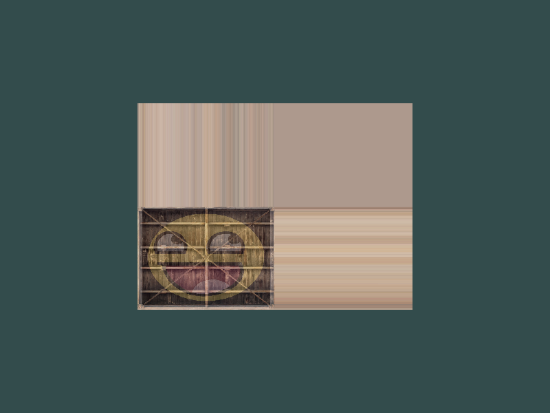
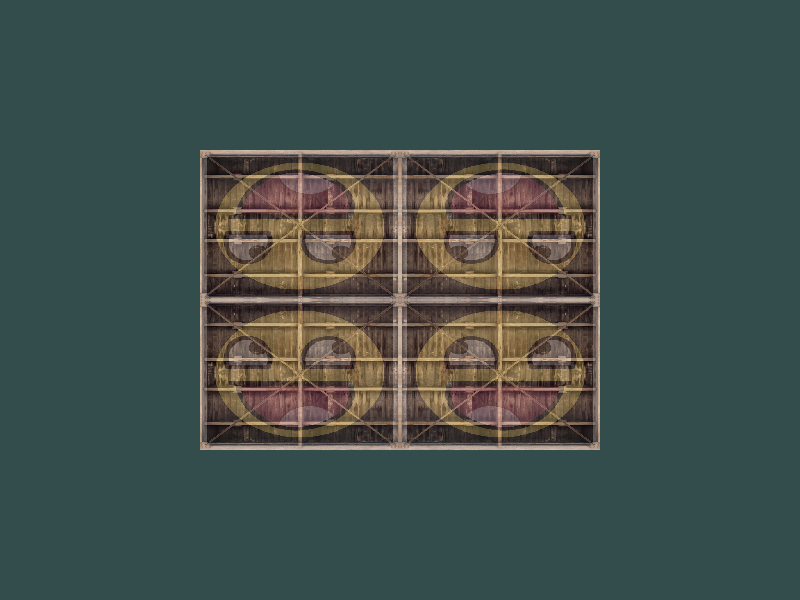
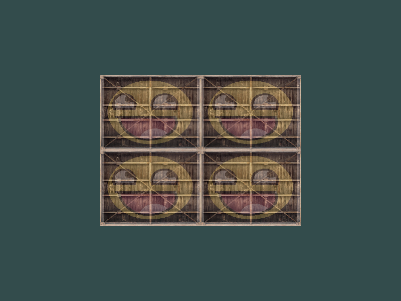
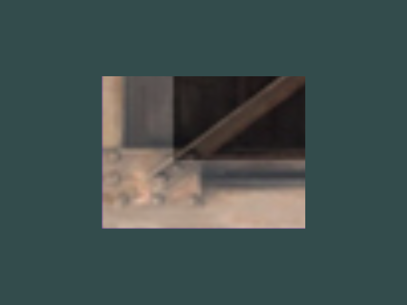

## 纹理 练习

- 修改笑脸朝向

  ```glsl
  // fragment glsl
  FragColor = mix(texture(texture1, TexCoord), texture(texture2, vec2(-TexCoord.x, TextCoord.y)), 0.2);
  ```
  
- 尝试不同的环绕方式

- `GL_CLAMP_TO_BORDER`环绕方式

  

- `GL_CLAMP_TO_EDGE`环绕方式

  

- `GL_MIRRORED_REPEAT`环绕方式

  

- `GL_REPEAT`环绕方式

  

- 使用`GL_NEAREST`过滤方式

  

- 使用`GL_LINEAR`过滤方式

  

- 使用一个`uniform`变量作为`mix`函数的第三个参数来改变两个纹理可见度

  ```glsl
  // fragment glsl
  FragColor = mix(texture(texture1, TexCoord), texture(texture2, TexCoord), abs(sin(factor * 0.2)));
  ```

  