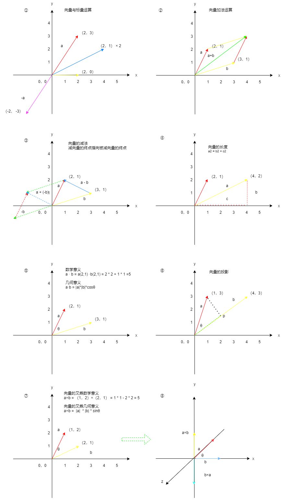
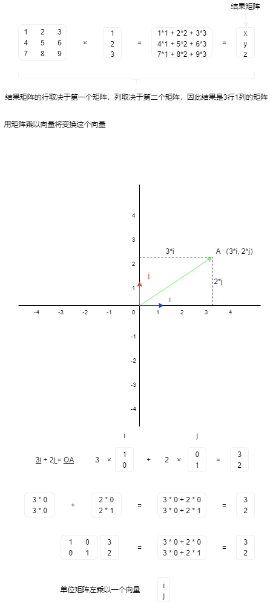
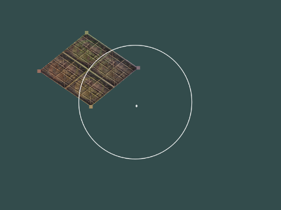
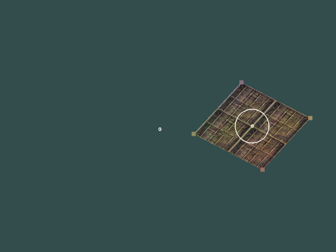
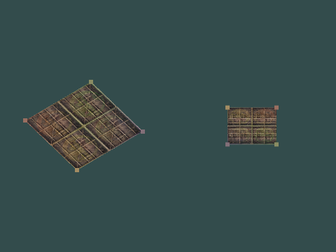

## 向量和矩阵

## 向量

## 知识点回顾

1. 向量与标量相加减乘除
2. 向量的长度计算
3. 向量取反
4. 向量单位化
5. 向量与向量相加减
6. 向量点乘
7. 向量叉乘
8. 矩阵介绍
9. 线性变换和仿射变换
10. 行主序和列主序
11. 矩阵与标量相加减和数乘

## 作业练习

### 练习 1

**先平移后旋转**

**物体的位置会因为旋转而发生变化**，是因为物体平移之后的坐标空间发生的变化，因此再使用旋转矩阵进行变换的时候物体是相对于世界空间的原点进行变换的

**先旋转后平移**

**物体的位置不会因为旋转而发生变化**，其原因是平移之前已经做了旋转变换，而旋转时其物体本身坐标空间还在世界中心

_个人理解如有错误还请指出，非常感谢_

### 练习 2

## 参考文章

-   [向量点乘叉乘的定义以及几何意义](http://www.360doc.com/content/19/1222/18/40070800_881412732.shtml)
-   [线性代数转置矩阵和逆矩阵](https://blog.csdn.net/yinhun2012/article/details/84236202)
-   [用矩阵表述变换与齐次坐标](https://www.jianshu.com/p/c3e887c4c4f4)
-   [仿射空间中几种基本映射的矩阵表述](https://www.jianshu.com/p/ccdee786acbd)
-   [如何通俗的解释仿射变换？](https://www.matongxue.com/madocs/244/)
-   [坐标系的概念和坐标系之间的变换](https://www.jianshu.com/p/f6b1b6d1f5ee)
-   [如何理解线性空间](https://www.zhihu.com/question/24086219)
-   [为什么 OpenGL 里的变换矩阵是 4x4 的?](https://juejin.cn/post/6886474840111317005)
-   [OpenGL 中矩阵的行主序与列主序](https://www.jianshu.com/p/bfc8327eaad3)
