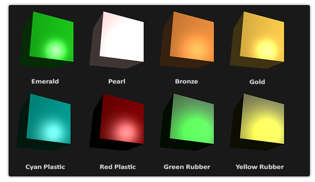
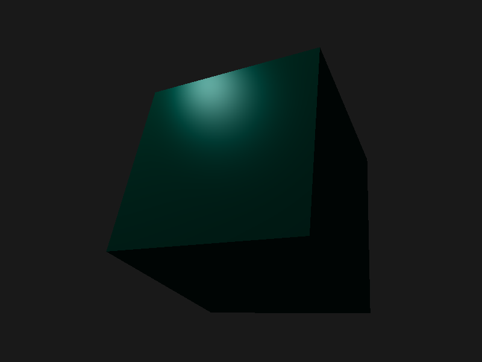

## 材质属性




```glsl
// 定义材质结构体
struct Material {
  vec3 ambient; // 环境光 颜色
  vec3 diffuse; // 漫反射 颜色
  vec3 specular; // 高光颜色
  float shininess; // 高光指数
};
uniform Material material;

// 光源属性
struct Light {
  vec3 position;

  vec3 ambient;
  vec3 diffuse;
  vec3 specular;
};

uniform Light light;
```



## 参考

https://learnopengl-cn.github.io/02%20Lighting/03%20Materials/
