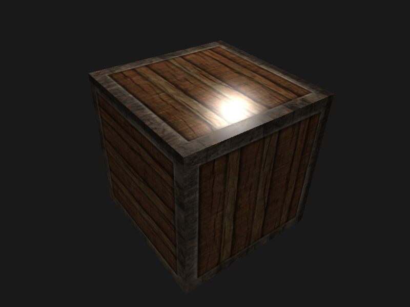
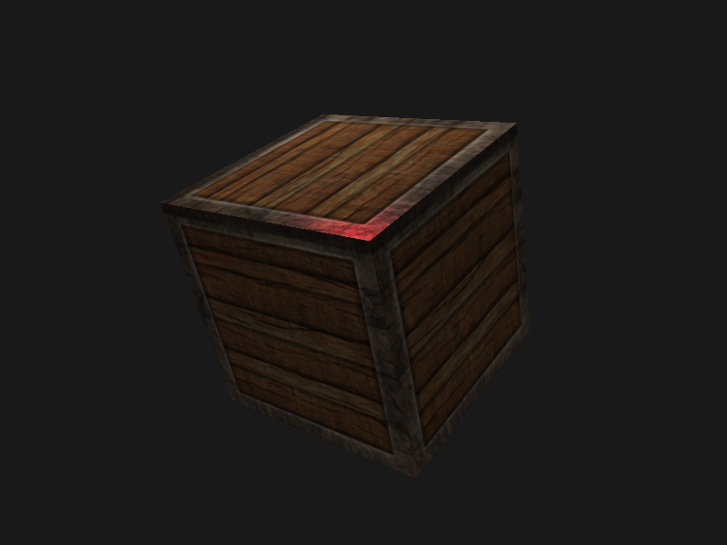
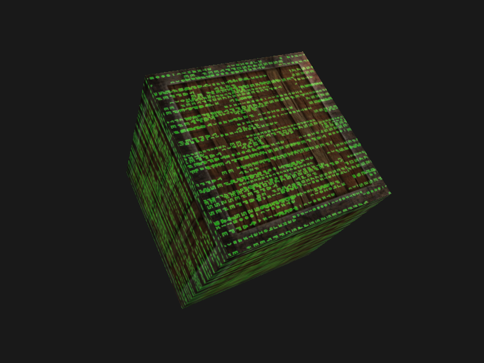

## 光照贴图练习

- 在片段着色器中反转镜面光贴图的颜色值，让木头显示镜面高光而钢制边缘不反光

  

  ```glsl
    vec3 specularTexture = vec3(vec4(1.0) - texture(material.specular, outTexCoord));
  ```

  

- 创建一个彩色而不是黑白的镜面光贴图

  ```glsl
  // 定义材质结构体
  struct Material {
    sampler2D diffuse; // 漫反射贴图
    sampler2D specular; // 镜面光贴图
    sampler2D specularColor; // 彩色镜面光贴图
    float shininess; // 高光指数
  };
  ```

- 放射光贴图添加到箱子上，产生这些字母都在发光的效果

  

  ```glsl
  
  uniform float factor;
  
  vec2 uv = outTexCoord;
  uv.y += factor;
  vec3 emissionTexture = vec3(texture(material.emission, uv));
  ```

  

## 参考

https://learnopengl-cn.github.io/02%20Lighting/04%20Lighting%20maps/#_2
