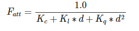
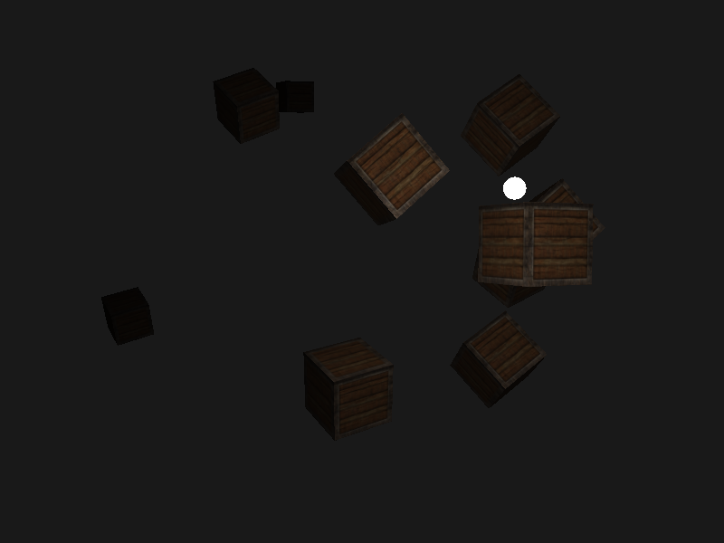
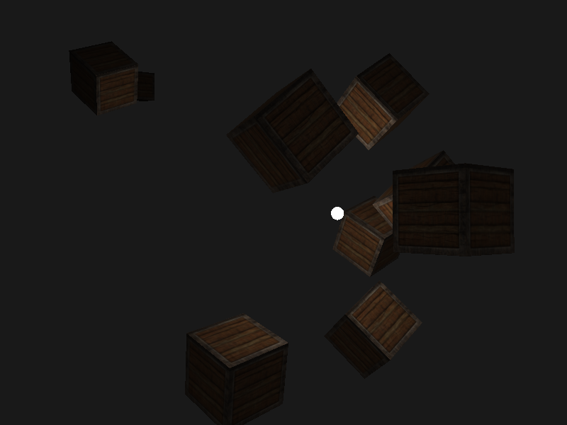

## 点光源

### 线性方程



- Kc：常数项
- Kl：一次项
- Kq：二次项

```glsl
// 光源
struct Light {
  vec3 position; // 光源位置

  vec3 ambient;
  vec3 diffuse;
  vec3 specular;

  float constant; // 常数项
  float linear; // 一次项
  float quadratic; // 二次项
};
```

### 计算方法

```glsl
// 计算衰减值
float distance = length(light.position - outFragPos);
float attenuation = 1.0 / (light.constant + light.linear * distance + light.quadratic * pow(distance, 2.0));

// 将环境光、漫反射、镜面光分别乘以衰减距离
ambient *= attenuation;
diffuse *= attenuation;
specular *= attenuation;
```

### 效果





