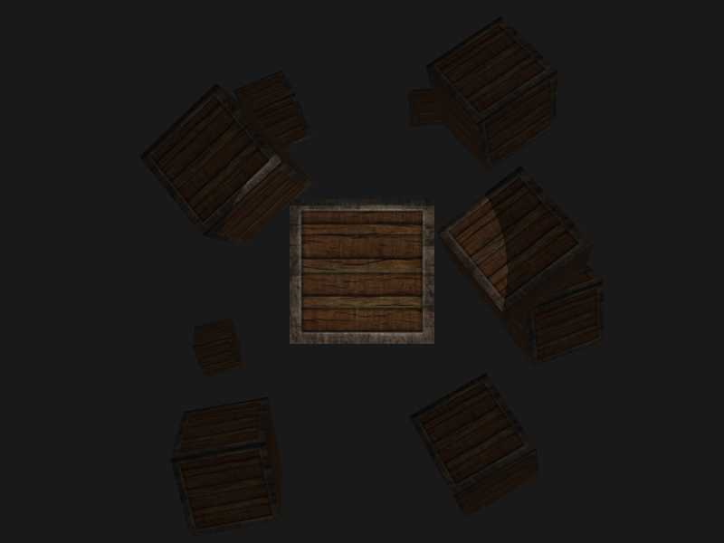
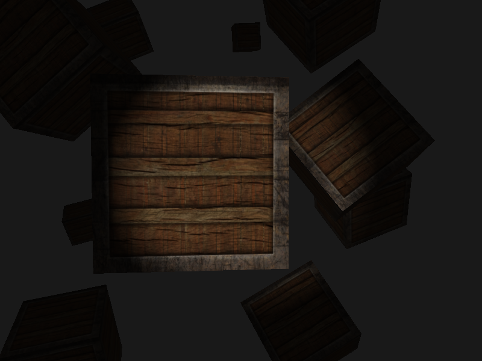

### 聚光


**圆锥边缘**



```glsl
#version 330 core
out vec4 FragColor;

// 材质
struct Material {
  sampler2D diffuse; // 漫反射贴图
  sampler2D specular; // 镜面光贴图
  float shininess; // 高光指数
};
uniform Material material;

// 光源
struct Light {
  vec3 position; // 光源位置

  vec3 direction; // 光照方向
  float cutOff; // 切光角

  vec3 ambient;
  vec3 diffuse;
  vec3 specular;

  float constant; // 常数项
  float linear; // 一次项
  float quadratic; // 二次项
};
uniform Light light;

in vec2 outTexCoord;
in vec3 outNormal;
in vec3 outFragPos;

uniform vec3 viewPos;
uniform float factor; // 变化值

void main() {

  vec3 lightDir = normalize(light.position - outFragPos);

  vec4 objectColor = vec4(1.0f, 1.0f, 1.0f, 1.0f);
  vec3 diffuseTexture = vec3(texture(material.diffuse, outTexCoord));
  vec3 specularTexture = vec3(texture(material.specular, outTexCoord));

  float theta = dot(lightDir, normalize(-light.direction));

  if(theta > light.cutOff) {

    // ambient
    vec3 ambient = light.ambient * diffuseTexture; 

    // diffuse
    vec3 norm = normalize(outNormal);
    float diff = max(dot(norm, lightDir), 0.0);
    vec3 diffuse = light.diffuse * diff * diffuseTexture;

    // specular
    vec3 viewDir = normalize(viewPos - outFragPos);
    vec3 reflectDir = reflect(-lightDir, norm);
    float spec = pow(max(dot(viewDir, reflectDir), 0.0), material.shininess);
    vec3 specular = light.specular * spec * specularTexture;

    // 计算衰减值
    float distance = length(light.position - outFragPos);
    float attenuation = 1.0 / (light.constant + light.linear * distance + light.quadratic * pow(distance, 2.0));
    // 将环境光、漫反射、镜面光分别乘以衰减距离
    diffuse *= attenuation;
    specular *= attenuation;

    vec3 result = (ambient + diffuse + specular) * vec3(objectColor);
    FragColor = vec4(result, 1.0);

  } else {
    FragColor = vec4(light.ambient * diffuseTexture, 1.0);
  }

}
```

**边缘软化**



```glsl
float theta = dot(lightDir, normalize(-light.direction));
float epsilon = light.cutOff - light.outerCutOff;
float intensity = clamp((theta - light.outerCutOff) / epsilon, 0.0, 1.0);

// 软化边缘
diffuse *= intensity;
specular *= intensity;
```

### 参考

https://learnopengl-cn.github.io/02%20Lighting/05%20Light%20casters/#_7
