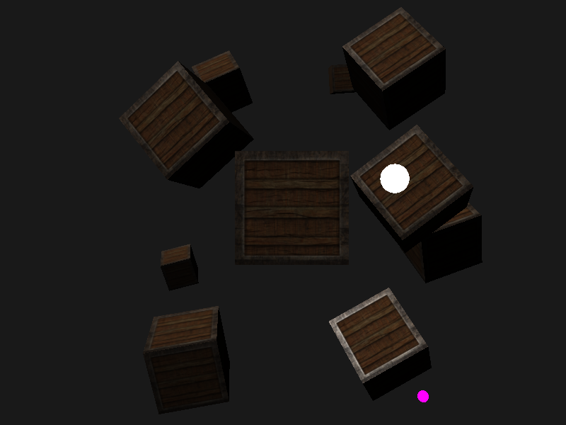
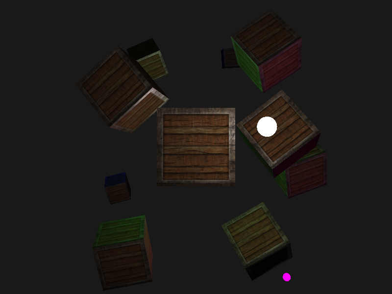
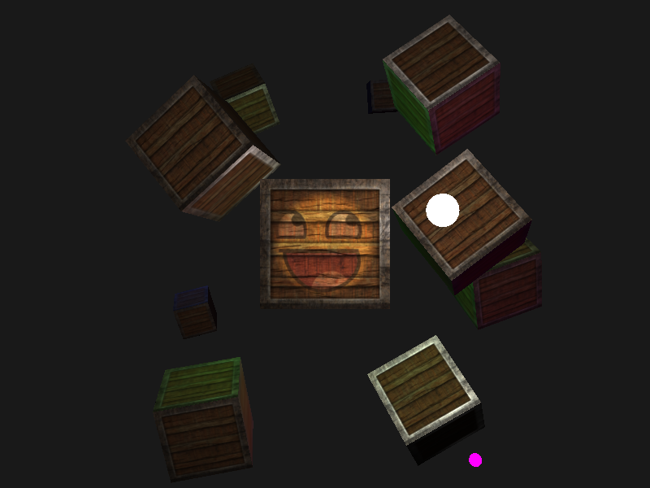

## 多光源

### 定向光

```glsl
// 定向光
struct DirectionLight {
  vec3 direction;

  vec3 ambient;
  vec3 diffuse;
  vec3 specular;
};

// 计算定向光
vec3 CalcDirectionLight(DirectionLight light, vec3 normal, vec3 viewDir) {
  vec3 lightDir = normalize(light.direction);
  float diff = max(dot(normal, lightDir), 0.0);
  vec3 reflectDir = reflect(-lightDir, normal);
  float spec = pow(max(dot(viewDir, reflectDir), 0.0), material.shininess);

  // 合并
  vec3 ambient = light.ambient * vec3(texture(material.diffuse, outTexCoord));
  vec3 diffuse = light.diffuse * diff * vec3(texture(material.diffuse, outTexCoord));
  vec3 specular = light.specular * spec * vec3(texture(material.specular, outTexCoord));

  return ambient + diffuse + specular;
}

```

**效果图**



### 点光

```glsl
// 点光源
struct PointLight {
  vec3 position;

  float constant;
  float linear;
  float quadratic;

  vec3 ambient;
  vec3 diffuse;
  vec3 specular;
};
// 计算点光源
vec3 CalcPointLight(PointLight light, vec3 normal, vec3 fragPos, vec3 viewDir) {
  vec3 lightDir = normalize(light.position - fragPos);
    // 漫反射着色
  float diff = max(dot(normal, lightDir), 0.0);
    // 镜面光着色
  vec3 reflectDir = reflect(-lightDir, normal);
  float spec = pow(max(dot(viewDir, reflectDir), 0.0), material.shininess);
    // 衰减
  float distance = length(light.position - fragPos);
  float attenuation = 1.0 / (light.constant + light.linear * distance +
    light.quadratic * (distance * distance));    
    // 合并结果
  vec3 ambient = light.ambient * vec3(texture(material.diffuse, outTexCoord));
  vec3 diffuse = light.diffuse * diff * vec3(texture(material.diffuse, outTexCoord));
  vec3 specular = light.specular * spec * vec3(texture(material.specular, outTexCoord));
  ambient *= attenuation;
  diffuse *= attenuation;
  specular *= attenuation;
  return (ambient + diffuse + specular);
}

```

**效果**



### 聚光光源

```glsl
// 聚光灯
struct SpotLight {
  vec3 position;
  vec3 direction;
  float cutOff;
  float outerCutOff;

  float constant;
  float linear;
  float quadratic;

  vec3 ambient;
  vec3 diffuse;
  vec3 specular;
};
// 计算聚光灯
vec3 CalcSpotLight(SpotLight light, vec3 normal, vec3 fragPos, vec3 viewDir) {
  vec3 lightDir = normalize(light.position - fragPos);
  float diff = max(dot(normal, lightDir), 0.0);
  vec3 reflectDir = reflect(-lightDir, normal);
  float spec = pow(max(dot(viewDir, reflectDir), 0.0), material.shininess);

  float distance = length(light.position - fragPos);
  float attenuation = 1.0 / (light.constant + light.linear * distance + light.quadratic * (distance * distance));

  float theta = dot(lightDir, normalize(-light.direction));
  float epsilon = light.cutOff - light.outerCutOff;
  float intensity = clamp((theta - light.outerCutOff) / epsilon, 0.0, 1.0);

  vec3 ambient = light.ambient * vec3(texture(material.diffuse, outTexCoord));
  vec3 diffuse = light.diffuse * diff * vec3(texture(material.diffuse, outTexCoord));
  vec3 specular = light.specular * spec * vec3(texture(material.specular, outTexCoord));

  ambient *= attenuation * intensity;
  diffuse *= attenuation * intensity;
  specular *= attenuation * intensity;
  return (ambient + diffuse + specular);
}
```

**效果**


### 整合效果

```glsl
  vec3 viewDir = normalize(viewPos - outFragPos);
  vec3 normal = normalize(outNormal);

  // 定向光照
  vec3 result = CalcDirectionLight(directionLight, normal, viewDir);

  // 点光源
  for(int i = 0; i < NR_POINT_LIGHTS; i++) {
    result += CalcPointLight(pointLights[i], normal, outFragPos, viewDir);
  }
  // 聚光光源
  result += CalcSpotLight(spotLight, normal, outFragPos, viewDir) * texture(awesomeMap, outTexCoord).rgb;

  FragColor = vec4(result, 1.0);
```

**效果图**



## 参考

https://learnopengl-cn.github.io/02%20Lighting/06%20Multiple%20lights/
