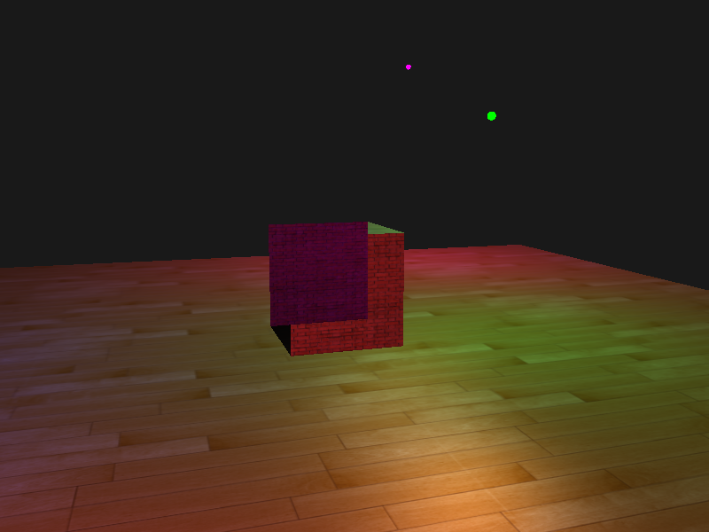
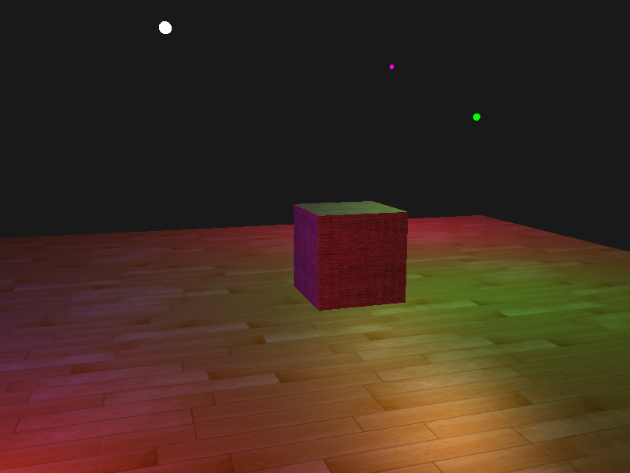
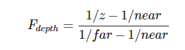
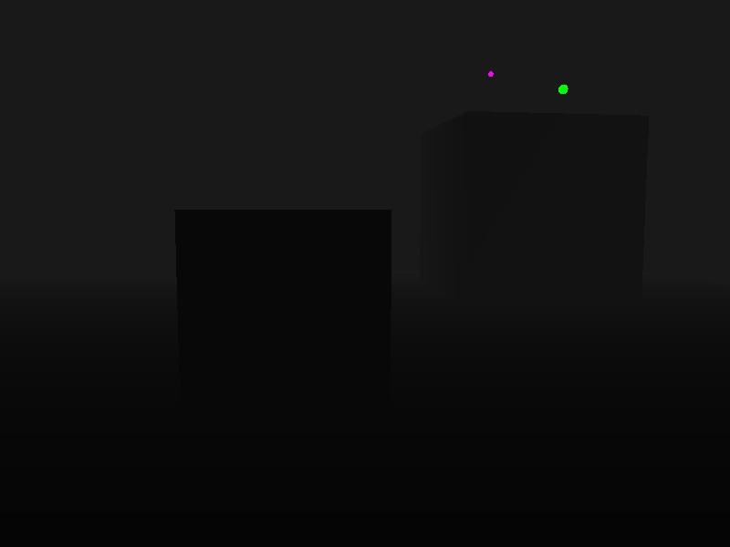
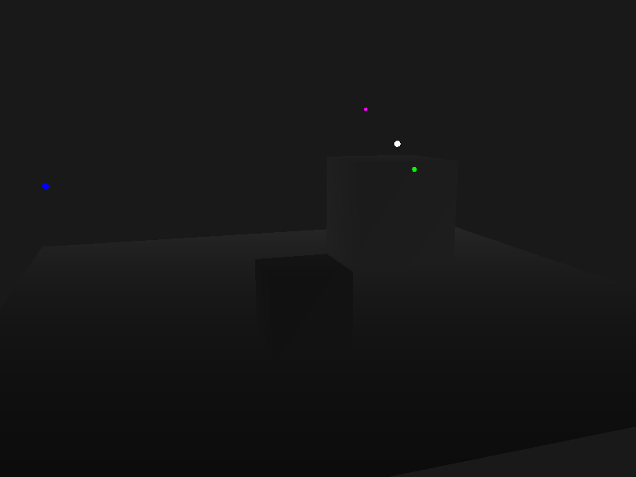
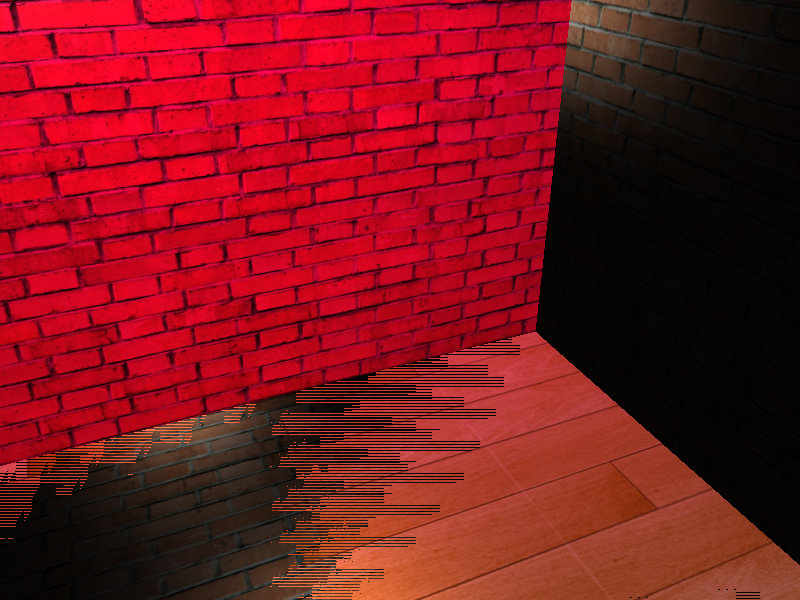

## 深度测试

| 函数        | 描述                                         |
| :---------- | :------------------------------------------- |
| GL_ALWAYS   | 永远通过深度测试                             |
| GL_NEVER    | 永远不通过深度测试                           |
| GL_LESS     | 在片段深度值小于缓冲的深度值时通过测试       |
| GL_EQUAL    | 在片段深度值等于缓冲区的深度值时通过测试     |
| GL_LEQUAL   | 在片段深度值小于等于缓冲区的深度值时通过测试 |
| GL_GREATER  | 在片段深度值大于缓冲区的深度值时通过测试     |
| GL_NOTEQUAL | 在片段深度值不等于缓冲区的深度值时通过测试   |
| GL_GEQUAL   | 在片段深度值大于等于缓冲区的深度值时通过测试 |

```glsl
  glEnable(GL_DEPTH_TEST);
  glDepthFunc(GL_ALWAYS);
```



```glsl
  glEnable(GL_DEPTH_TEST);
  glDepthFunc(GL_LESS);
```



## 深度值可视化



```glsl
float LinearizeDepth(float depth, float near, float far) {
  float z = depth * 2.0 - 1.0;
  return (2.0 * near * far) / (far + near - z * (far - near));
}

float depth = LinearizeDepth(gl_FragCoord.z, near, far) / far;
FragColor = vec4(vec3(depth), 1.0);
```






## 深度冲突

深度缓冲没有足够的精度来决定两个形状哪个在前面。



**解决办法**

1. 不要把多个物体摆得太靠近，以至于它们的一些三角形会重叠。
2. 尽可能将近平面设置远一些。
3. 使用更高精度的深度缓冲。

## 参考

https://learnopengl-cn.github.io/04%20Advanced%20OpenGL/01%20Depth%20testing/
