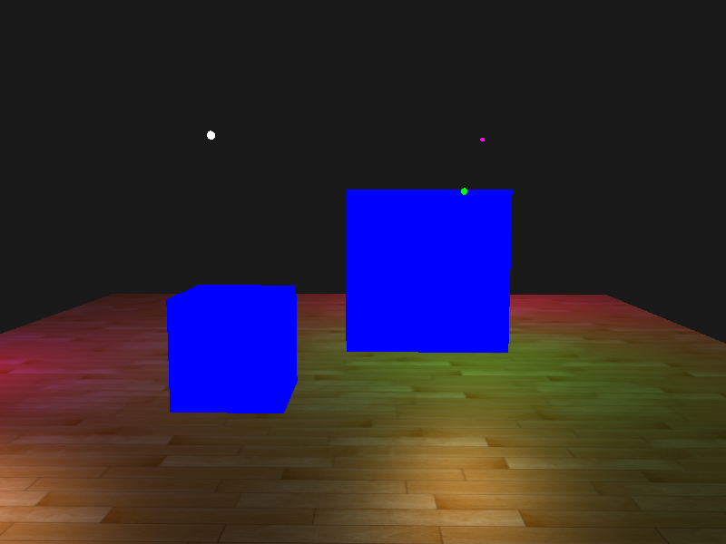
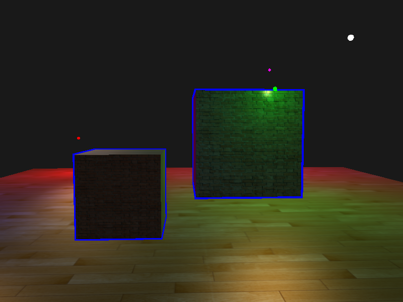
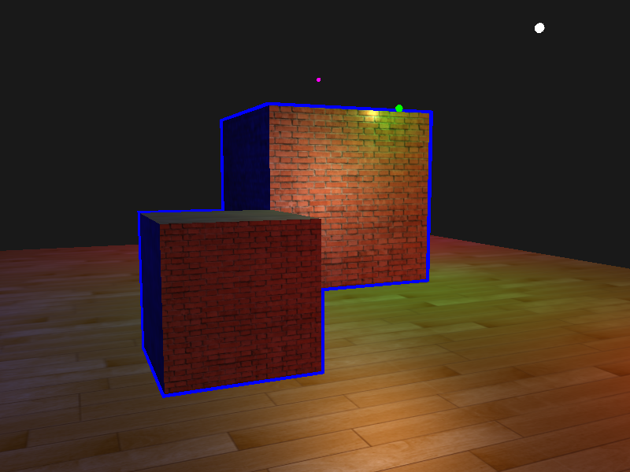

## 模板测试








```glsl
glEnable(GL_DEPTH_TEST);
glStencilOp(GL_KEEP, GL_KEEP, GL_REPLACE);  
glClear(GL_COLOR_BUFFER_BIT | GL_DEPTH_BUFFER_BIT | GL_STENCIL_BUFFER_BIT); 

glStencilMask(0x00); // 记得保证我们在绘制地板的时候不会更新模板缓冲
//绘制地板

glStencilFunc(GL_ALWAYS, 1, 0xFF); 
glStencilMask(0xFF); 
// 正常绘制盒子

sceneShader.setBool("stenci", true);
glStencilFunc(GL_NOTEQUAL, 1, 0xFF);
glStencilMask(0x00); 
glDisable(GL_DEPTH_TEST);
// 正常放大的盒子
glStencilMask(0xFF);
glEnable(GL_DEPTH_TEST);  
sceneShader.setBool("stenci", false);
```

```glsl
result = mix(result, vec3(0.0, 0.0, 1.0), stenci);
FragColor = vec4(result, 1.0);
```

## 参考

https://learnopengl-cn.github.io/04%20Advanced%20OpenGL/02%20Stencil%20testing/
