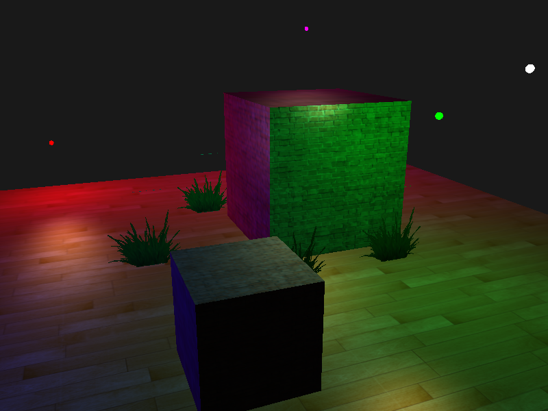
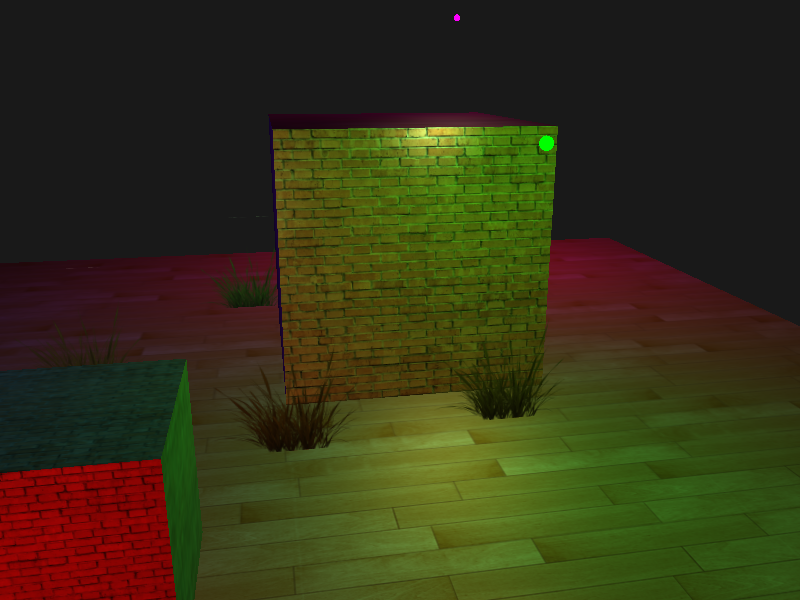
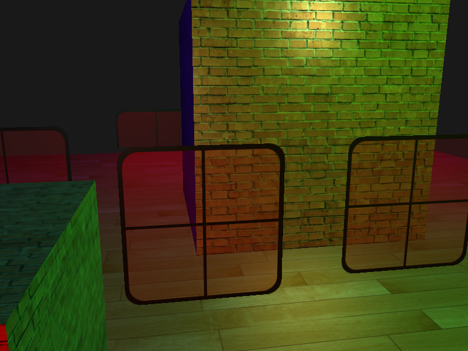
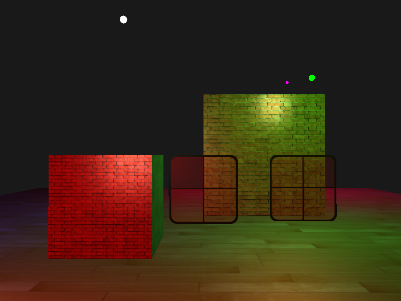
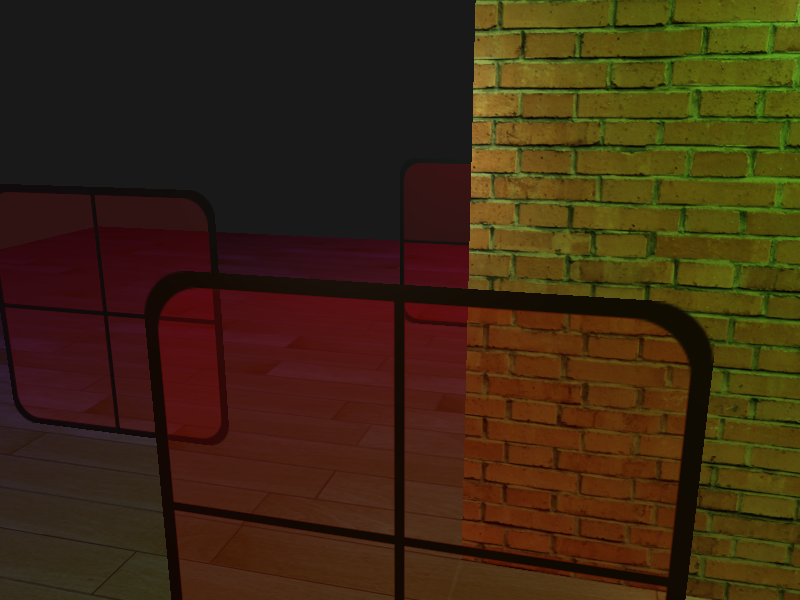

## 混合

### 片元丢弃

```glsl
  vec4 texMap = texture(brickMap, outTexCoord);
  if(texMap.a < 0.1)
    discard;
```



### 启用混合

```c++
  glEnable(GL_BLEND);
  glBlendFunc(GL_SRC_ALPHA, GL_ONE_MINUS_SRC_ALPHA);
```

```glsl
  vec4 texMap = texture(brickMap, outTexCoord);
  vec4 color = vec4(result, 1.0) * texMap;
  FragColor = vec4(color);
```







### 动态排序

对透明物体按照观察者视角获取的距离排序

```glsl
    // 对透明物体进行动态排序
    std::map<float, glm::vec3> sorted;
    for (unsigned int i = 0; i < grassPositions.size(); i++)
    {
      float distance = glm::length(camera.Position - grassPositions[i]);
      sorted[distance] = grassPositions[i];
    }

    for (std::map<float, glm::vec3>::reverse_iterator iterator = sorted.rbegin(); iterator != sorted.rend(); iterator++)
    {
      model = glm::mat4(1.0f);
      model = glm::translate(model, iterator->second);
      sceneShader.setMat4("model", model);
      glDrawElements(GL_TRIANGLES, grassGeometry.indices.size(), GL_UNSIGNED_INT, 0);
    }


```



## 参考

https://learnopengl-cn.github.io/04%20Advanced%20OpenGL/03%20Blending/
