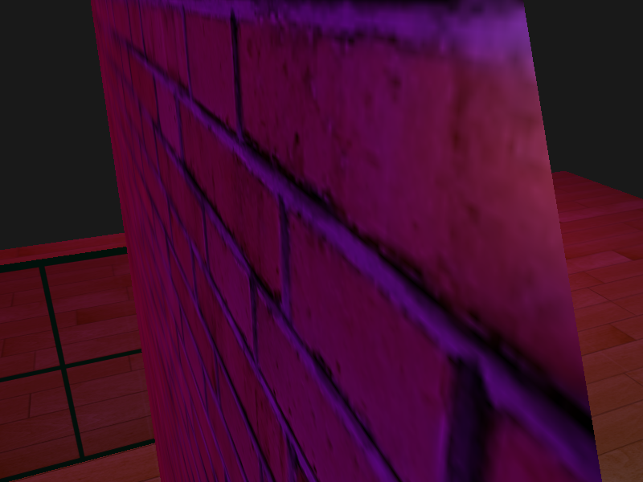
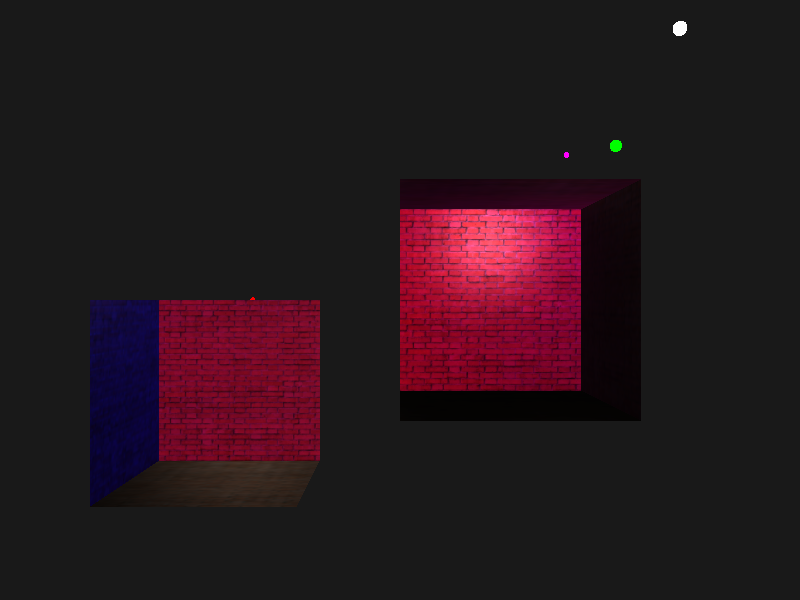

## 面剔除






```c++
glEnable(GL_CULL_FACE);
glCullFace(GL_FRONT);
```

glCullFace函数有三个可用的选项：

- `GL_BACK`：只剔除背向面。
- `GL_FRONT`：只剔除正向面。
- `GL_FRONT_AND_BACK`：剔除正向面和背向面。

## 参考

https://learnopengl-cn.github.io/04%20Advanced%20OpenGL/04%20Face%20culling/#_3
