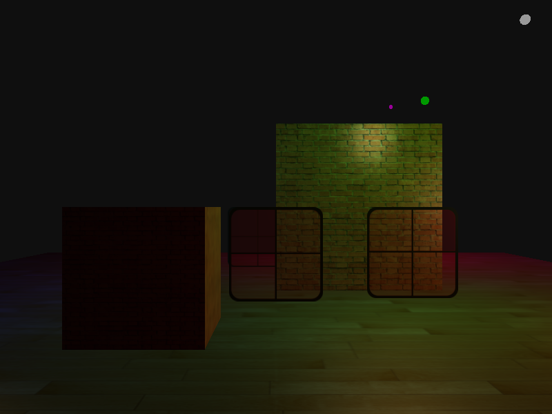
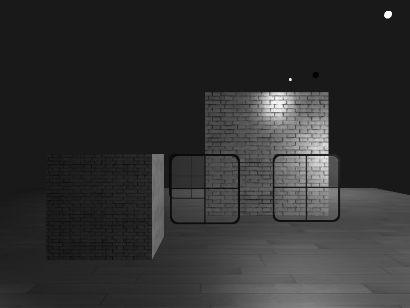
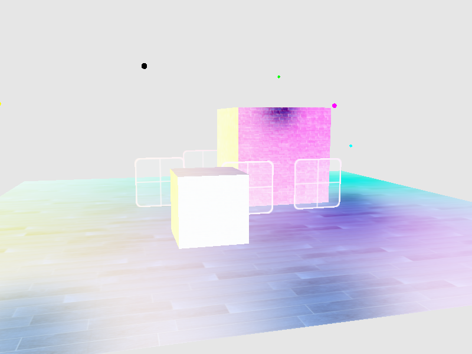
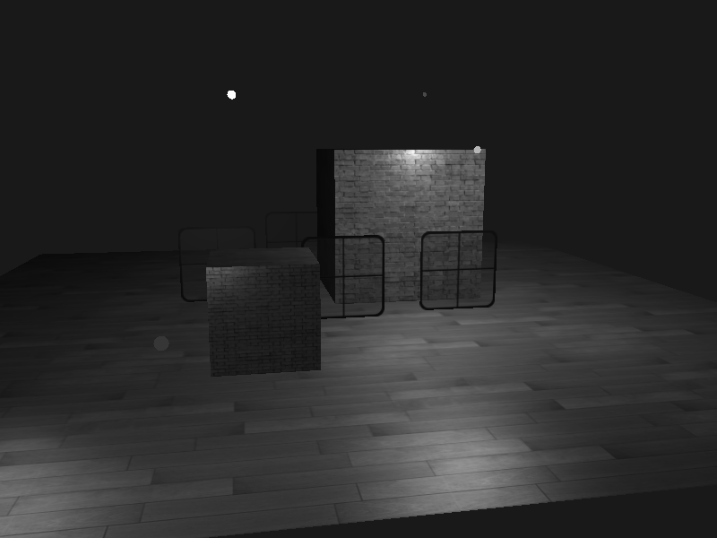
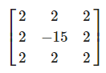
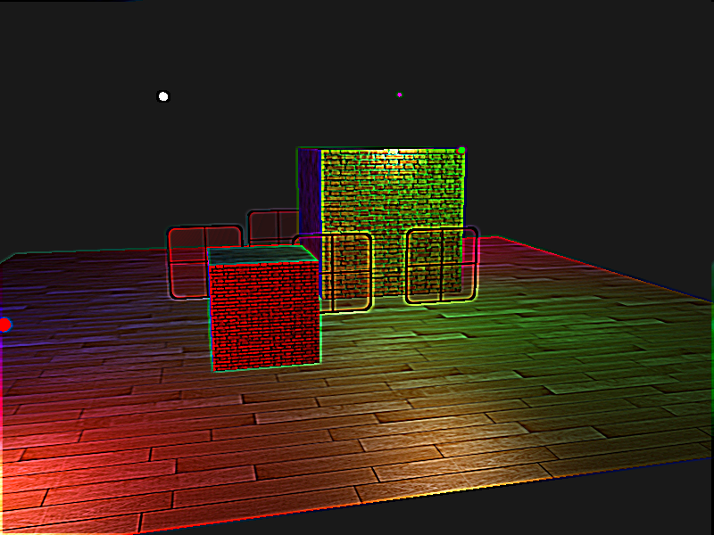
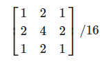
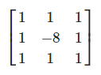
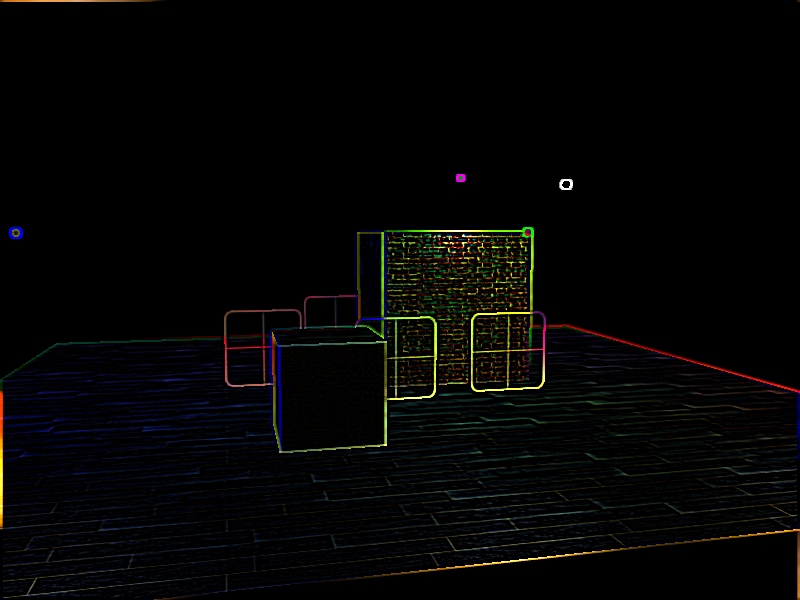

## 帧缓冲

### 创建帧缓冲

```c++
unsigned int framebuffer; // 创建帧缓冲
glGenFramebuffers(1, &framebuffer);
glBindFramebuffer(GL_FRAMEBUFFER, framebuffer);
```

### 纹理附件

```c++
unsigned int texColorBuffer; // 生成纹理
glGenTextures(1, &texColorBuffer);
glBindTexture(GL_TEXTURE_2D, texColorBuffer);
glTexImage2D(GL_TEXTURE_2D, 0, GL_RGB, SCREEN_WIDTH, SCREEN_HEIGHT, 0, GL_RGB, GL_UNSIGNED_BYTE, NULL);
glTexParameteri(GL_TEXTURE_2D, GL_TEXTURE_MIN_FILTER, GL_LINEAR);
glTexParameteri(GL_TEXTURE_2D, GL_TEXTURE_MAG_FILTER, GL_LINEAR);
glBindTexture(GL_TEXTURE_2D, 0);
```

**将颜色纹理添加到当前绑定的帧缓冲**

```c++
glFramebufferTexture2D(GL_FRAMEBUFFER, GL_COLOR_ATTACHMENT0, GL_TEXTURE_2D, texColorBuffer, 0);
```

### 设置渲染缓冲对象

```c++
unsigned int renderBuffer;
glGenRenderbuffers(1, &renderBuffer);
glBindRenderbuffer(GL_RENDERBUFFER, renderBuffer);
glRenderbufferStorage(GL_RENDERBUFFER, GL_DEPTH24_STENCIL8, SCREEN_WIDTH, SCREEN_HEIGHT);
glBindRenderbuffer(GL_RENDERBUFFER, 0);

glFramebufferRenderbuffer(GL_FRAMEBUFFER, GL_DEPTH_STENCIL_ATTACHMENT, GL_RENDERBUFFER, renderBuffer); // 将渲染缓冲对象附加到帧缓冲的深度和模板附件上

if (glCheckFramebufferStatus(GL_FRAMEBUFFER) != GL_FRAMEBUFFER_COMPLETE)
{
    std::cout << "ERROR:Framebuffer is not complete!" << std::endl;
}
glBindFramebuffer(GL_FRAMEBUFFER, 0);
```

**渲染循环**

```c++
while(){
    // 第一处理阶段
    glBindFramebuffer(GL_FRAMEBUFFER, framebuffer);
    glEnable(GL_DEPTH_TEST);

    glClearColor(clear_color.x, clear_color.y, clear_color.z, clear_color.w);
    glClear(GL_COLOR_BUFFER_BIT | GL_DEPTH_BUFFER_BIT);
    
    // 正常绘制场景
    drawScene...
    
    // 第二处理阶段
    glBindFramebuffer(GL_FRAMEBUFFER, 0); // 返回默认的帧缓冲对象
    glDisable(GL_DEPTH_TEST);

    glClearColor(1.0f, 1.0f, 1.0f, 1.0f);
    glClear(GL_COLOR_BUFFER_BIT);

    frameBufferShader.use();//绘制创建的帧缓冲屏幕窗口
    glBindVertexArray(frameGeometry.VAO);
    glBindTexture(GL_TEXTURE_2D, texColorBuffer);
    glDrawElements(GL_TRIANGLES, frameGeometry.indices.size(), GL_UNSIGNED_INT, 0);
}
```

**vertex shader**

```glsl
#version 330 core
layout(location = 0) in vec3 Position;
layout(location = 1) in vec3 Normal;
layout(location = 2) in vec2 TexCoords;
out vec2 outTexCoord;

void main() {
  gl_Position = vec4(Position.x, Position.y, 0.0f, 1.0f);
  outTexCoord = TexCoords;
}
```

**fragment shader**

```glsl
#version 330 core
out vec4 FragColor;
in vec2 outTexCoord;

uniform sampler2D screenTexture;

void main() {
  FragColor = texture(screenTexture, outTexCoord);
}
```

**效果**




```glsl
#version 330 core
out vec4 FragColor;
in vec2 outTexCoord;

uniform sampler2D screenTexture;

void main() {

  vec3 texColor = texture(screenTexture, outTexCoord).rgb;
  FragColor = vec4(vec3(texColor.r), 1.0);
}
```



## 后期处理

### 反相

```glsl

vec3 texColor = 1.0 - texture(screenTexture, outTexCoord).rgb;
FragColor = vec4(texColor, 1.0);
```



### 灰度

```glsl
vec3 texColor = texture(screenTexture, outTexCoord).rgb;
float average = 0.2126 * texColor.r + 0.7152 * texColor.g + 0.0722 * texColor.b;
FragColor = vec4(vec3(average), 1.0);
```



### 核效果

#### 锐化



```glsl
#version 330 core
out vec4 FragColor;
in vec2 outTexCoord;

uniform sampler2D screenTexture;

const float offset = 1.0 / 300.0;
void main() {
  vec2 offsets[9] = vec2[] (
  vec2(-offset, offset), // 左上
  vec2(0.0f, offset), // 正上
  vec2(offset, offset), // 右上
  vec2(-offset, 0.0f),   // 左
  vec2(0.0f, 0.0f),   // 中
  vec2(offset, 0.0f),   // 右
  vec2(-offset, -offset), // 左下
  vec2(0.0f, -offset), // 正下
  vec2(offset, -offset)  // 右下
  );

  float kernel[9] = float[] (-1, -1, -1, -1, 9, -1, -1, -1, -1);
  vec3 sampleTex[9];
  for(int i = 0; i < 9; i++) {
    sampleTex[i] = vec3(texture(screenTexture, outTexCoord.st + offsets[i]));
  }

  vec3 col = vec3(0.0);
  for(int i = 0; i < 9; i++){
     col += sampleTex[i] * kernel[i];
  }
  FragColor = vec4(col, 1.0);
}
```



#### 模糊



```glsl
float kernel[9] = float[](
    1.0 / 16, 2.0 / 16, 1.0 / 16,
    2.0 / 16, 4.0 / 16, 2.0 / 16,
    1.0 / 16, 2.0 / 16, 1.0 / 16  
);
```


#### 显示边缘



```glsl
  float kernel[9] = float[] (
      1.0, 1.0, 1.0, 
      1.0, -8.0, 1.0, 
      1.0, 1.0, 1.0
  );
```



## 参考

https://learnopengl-cn.github.io/04%20Advanced%20OpenGL/05%20Framebuffers/#_9
