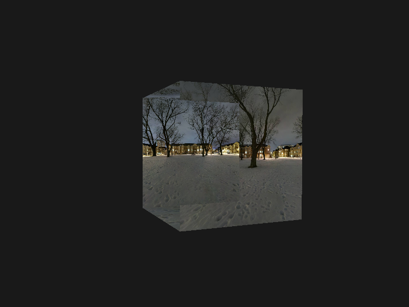
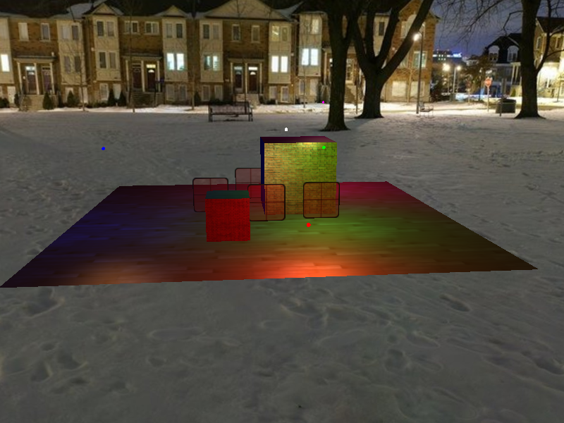

## 立方体贴图

### 天空盒

`GL_TEXTURE_CUBE_MAP`包含六个纹理

| 纹理目标                         | 方位 | 简称 |
| :------------------------------- | :--- | :--- |
| `GL_TEXTURE_CUBE_MAP_POSITIVE_X` | 右   | px   |
| `GL_TEXTURE_CUBE_MAP_NEGATIVE_X` | 左   | ny   |
| `GL_TEXTURE_CUBE_MAP_POSITIVE_Y` | 上   | py   |
| `GL_TEXTURE_CUBE_MAP_NEGATIVE_Y` | 下   | ny   |
| `GL_TEXTURE_CUBE_MAP_POSITIVE_Z` | 后   | pz   |
| `GL_TEXTURE_CUBE_MAP_NEGATIVE_Z` | 前   | nz   |


### 绘制天空盒

**vertex shader**

```glsl
#version 330 core
layout(location = 0) in vec3 Position;
out vec3 outTexCoord;
uniform mat4 view;
uniform mat4 projection;

void main() {
	outTexCoord = Position;
	vec4 pos = projection * view * vec4(Position, 1.0);
	gl_Position = pos;
}
```

**fragment shader**

```glsl
#version 330 core
layout(location = 0) in vec3 Position;
layout(location = 1) in vec3 Normal;
layout(location = 2) in vec2 TexCoords;
out vec2 outTexCoord;

uniform mat4 model;
uniform mat4 view;
uniform mat4 projection;

void main() {
  gl_Position = projection * view * model * vec4(Position, 1.0f);
  outTexCoord = TexCoords;
}
```


```c++
// 绘制天空盒
glDepthFunc(GL_LEQUAL);
glDisable(GL_DEPTH_TEST);

skyboxShader.use();
skyboxShader.setMat4("view", view);
skyboxShader.setMat4("projection", projection);

glActiveTexture(GL_TEXTURE0);
glBindTexture(GL_TEXTURE_CUBE_MAP, cubemapTexture);
glBindVertexArray(skyboxGeometry.VAO);
glDrawElements(GL_TRIANGLES, skyboxGeometry.indices.size(), GL_UNSIGNED_INT, 0);

glBindVertexArray(0);
glDepthFunc(GL_LESS);
glEnable(GL_DEPTH_TEST);
```



### 移除平移

```c++
view = glm::mat4(glm::mat3(camera.GetViewMatrix())); // 移除平移分量

// 绘制其它物体时恢复
view = camera.GetViewMatrix();
```



## 参考

https://learnopengl-cn.github.io/04%20Advanced%20OpenGL/06%20Cubemaps/

