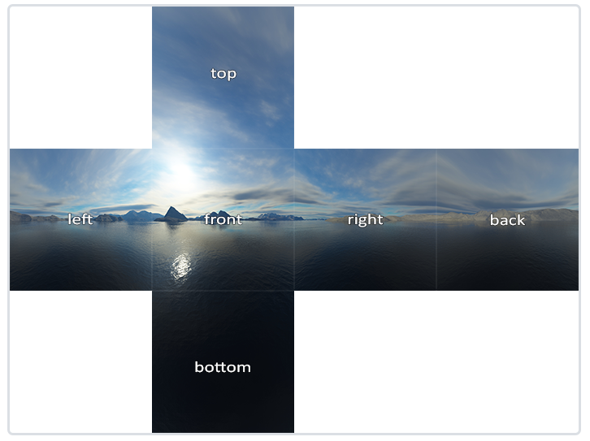
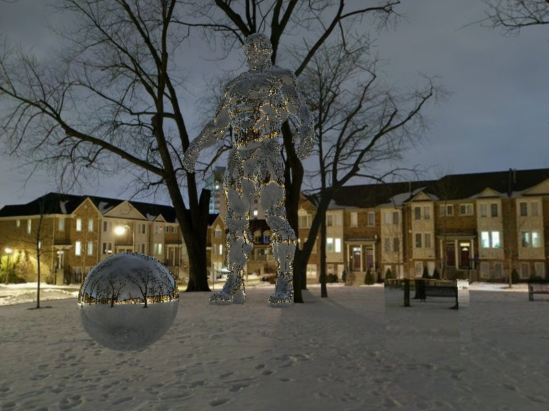
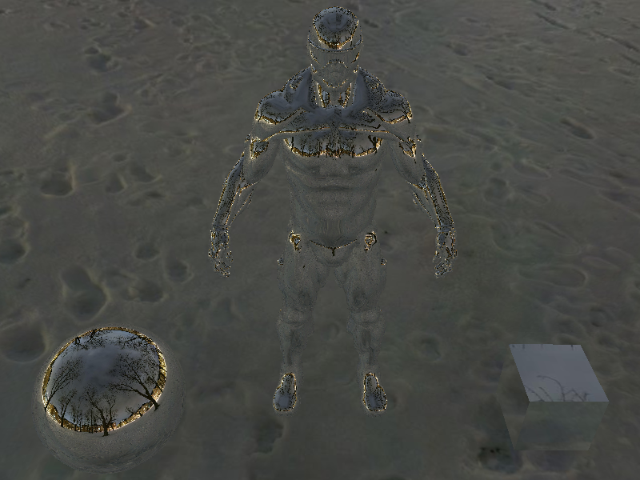
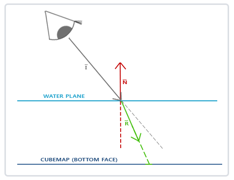
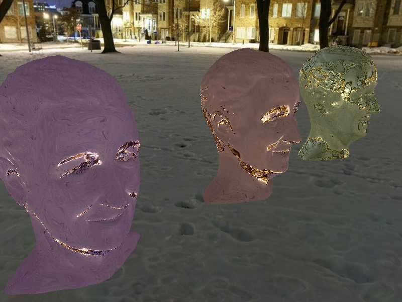
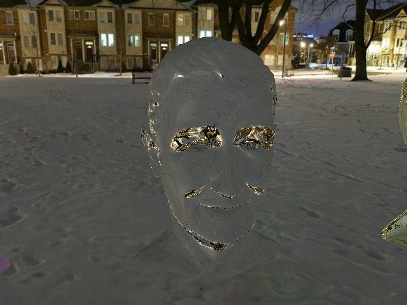

## 环境映射

`GL_TEXTURE_CUBE_MAP`包含六个纹理

| 纹理目标                         | 方位 | 简称 |
| :------------------------------- | :--- | :--- |
| `GL_TEXTURE_CUBE_MAP_POSITIVE_X` | 右   | px   |
| `GL_TEXTURE_CUBE_MAP_NEGATIVE_X` | 左   | ny   |
| `GL_TEXTURE_CUBE_MAP_POSITIVE_Y` | 上   | py   |
| `GL_TEXTURE_CUBE_MAP_NEGATIVE_Y` | 下   | ny   |
| `GL_TEXTURE_CUBE_MAP_POSITIVE_Z` | 后   | pz   |
| `GL_TEXTURE_CUBE_MAP_NEGATIVE_Z` | 前   | nz   |



### 反射


根据观察方向向量I和物体的法向量N，来计算反射向量R。我们可以使用GLSL内建的reflect函数来计算这个反射向量。最终的R向量将会作为索引/采样立方体贴图的方向向量，返回环境的颜色值。最终的结果是物体看起来反射了天空盒。

**vertex shader**

```glsl
#version 330 core
layout (location = 0) in vec3 Position;
layout (location = 1) in vec3 Normal;
layout (location = 2) in vec2 TexCoords;

out vec2 oTexCoord;
out vec3 oNormal;
out vec3 oPosition;

uniform mat4 model;
uniform mat4 view;
uniform mat4 projection;

void main()
{
    oTexCoord = TexCoords;
    oNormal = mat3(transpose(inverse(model))) * Normal;
    oPosition = vec3(model * vec4(Position, 1.0));
    gl_Position = projection * view * model * vec4(Position, 1.0);
}
```

**fragment shader**

```glsl
#version 330 core
out vec4 FragColor;

in vec2 oTexCoord;
in vec3 oNormal;
in vec3 oPosition;

uniform vec3 cameraPos;
uniform samplerCube cubeTexture;

void main()
{             
    vec3 I = normalize(oPosition - cameraPos);
    vec3 R = reflect(I, normalize(oNormal));
    FragColor = vec4(texture(cubeTexture, R).rgb, 1.0);
}
```





### 折射



折射是光线由于传播介质的改变而产生的方向变化，折射是通过[斯涅尔定律](https://en.wikipedia.org/wiki/Snell's_law)来描述的，同样，我们有一个观察向量I，一个法向量N，而这次是折射向量R。可以看到，观察向量的方向轻微弯曲了。弯折后的向量R将会用来从立方体贴图中采样。

**fragment shader**

```glsl
#version 330 core
out vec4 FragColor;

in vec2 oTexCoord;
in vec3 oNormal;
in vec3 oPosition;

uniform vec3 cameraPos;
uniform samplerCube cubeTexture;
uniform vec3 objectColor;

void main() {
    float ratio = 1.0 / 1.52;
    vec3 I = normalize(oPosition - cameraPos);
    vec3 R = refract(I, normalize(oNormal), ratio);
    FragColor = vec4(texture(cubeTexture, R).rgb + objectColor, 1.0);
}
```





## 参考

https://learnopengl-cn.github.io/04%20Advanced%20OpenGL/06%20Cubemaps/

