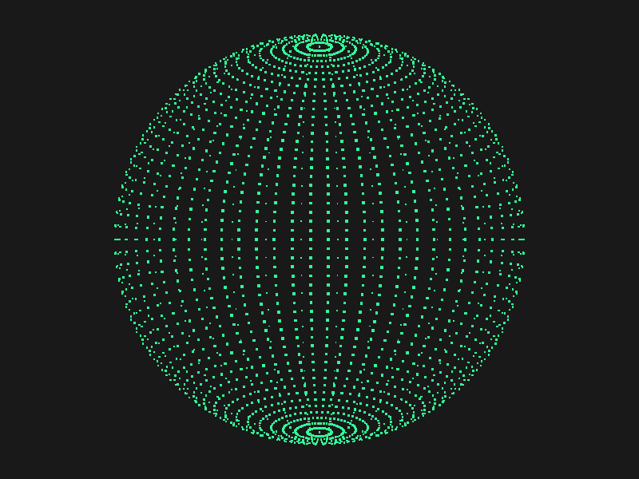
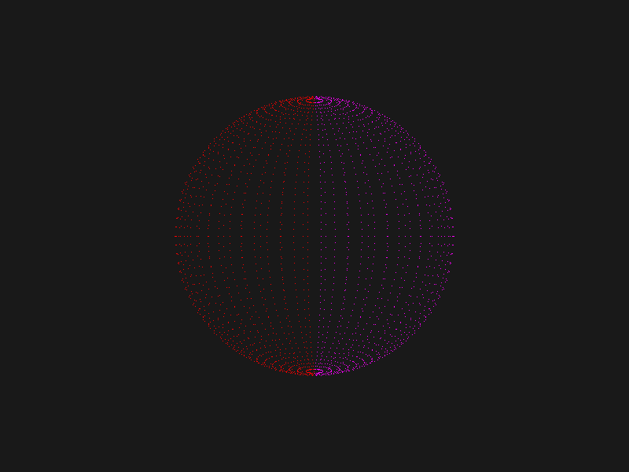
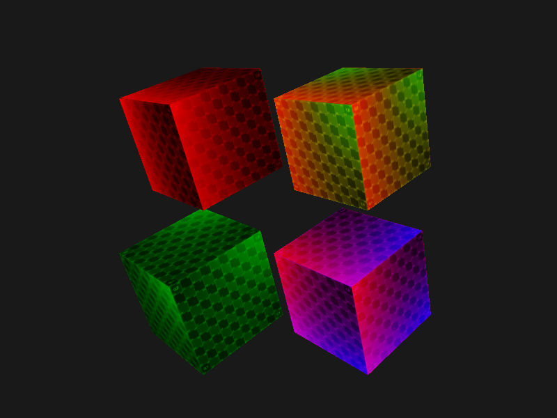

## 高级 GLSL

### 内建变量

### **顶点着色器变量**

#### gl_Position

#### gl_PointSize

渲染点的话需要启用

`glEnable(GL_PROGRAM_POINT_SIZE)`

```glsl
gl_PointSize = gl_Position.z;
```



- gl_VertexID ：输入变量，存储正在绘制顶点的当前索引

### **片段着色器变量**

#### gl_FragCoord

- x和y分量是片段窗口空间坐标，其原点为窗口的左下角
- z分量对应片段的深度值
- 只读变量，无法修改

**将屏幕分成不同颜色**

```glsl
  vec3 result = vec3(1.0);
  if(gl_FragCoord.x < 400) {
    result = vec3(1.0, 0.0, 0.0);
  } else {
    result = vec3(1.0, 0.0, 1.0);
  }
```



#### gl_FrontFacing

结果是一个bool，如果当前片段的是正向面的一部分返回true，否则是false

通过此变量显示内外显示不同的纹理

```glsl
  vec3 result = vec3(1.0);
  if(gl_FrontFacing) {
    result = texture(uvMap, oTexCoord).rgb;
  } else {
    result = texture(triMap, oTexCoord).rgb;
  }
  FragColor = vec4(result, 1.0);
```


#### gl_FragDepth

设置片段的深度值（0.0， 1.0），如果着色器没有写入值到gl_FragDepth，它会自动取用gl_FragCoord.z的值

> 深度缓冲是在片段着色器（以及模板测试）运行之后在屏幕空间中运行的

> 现在大部分的GPU都提供一个叫做提前深度测试(Early Depth Testing)的硬件特性。提前深度测试允许深度测试在片段着色器之前运行。只要我们清楚一个片段永远不会是可见的（它在其他物体之后），我们就能提前丢弃这个片段。
>
> 片段着色器通常开销都是很大的，所以我们应该尽可能避免运行它们。当使用提前深度测试时，片段着色器的一个限制是你不能写入片段的深度值。如果一个片段着色器对它的深度值进行了写入，提前深度测试是不可能的。OpenGL不能提前知道深度值。

> 如果在片段着色器中设置gl_FragDepth的值，那么OpenGL会禁用所有的**提前深度测试**，因为OpenGL无法在片段着色器运行之前得知片段将拥有的深度值，片段着色器可能会修改这个值

**OpenGL4.2可以在片段着色器顶部重新声明**

`layout (depth_<condition>) out float gl_FragDepth;`

`condition`可以为下面的值：

| 条件        | 描述                                                         |
| :---------- | :----------------------------------------------------------- |
| `any`       | 默认值。提前深度测试是禁用的，你会损失很多性能               |
| `greater`   | 你只能让深度值比`gl_FragCoord.z`更大                         |
| `less`      | 你只能让深度值比`gl_FragCoord.z`更小                         |
| `unchanged` | 如果你要写入`gl_FragDepth`，你将只能写入`gl_FragCoord.z`的值 |

通过将深度条件设置为`greater`或者`less`，OpenGL就能假设你只会写入比当前片段深度值更大或者更小的值了。这样子的话，当深度值比片段的深度值要小的时候，OpenGL仍是能够进行提前深度测试的。


### 接口块

顶点着色器到片段着色器的输入

**vertex shader**

```glsl
out VS_OUT
{
    vec2 TexCoords;
} vs_out;
```

**fragment shader**

```glsl
in VS_OUT
{
    vec2 TexCoords;
} fs_in;
```


### Uniform 块

在顶点着色器中定义一下uniform块

```glsl
layout (std140) uniform Matrices
{
    mat4 projection;
    mat4 view;
};
```

这里声明了一个Matrices的uniform块，存储了两个4*4矩阵，其中的变量可以直接访问，不需要假前缀，每个声明了这个uniform块的着色器都能访问这些矩阵。

**基准对其量**

表示一个变量在uniform块中所占据的空间，以上的view占据`16N`，每四个字节用一个`N`来表示。

| 类型                | 布局规则                                                     |
| :------------------ | :----------------------------------------------------------- |
| 标量，比如int和bool | 每个标量的基准对齐量为N。                                    |
| 向量                | 2N或者4N。这意味着vec3的基准对齐量为4N。                     |
| 标量或向量的数组    | 每个元素的基准对齐量与vec4的相同。                           |
| 矩阵                | 储存为列向量的数组，每个向量的基准对齐量与vec4的相同。       |
| 结构体              | 等于所有元素根据规则计算后的大小，但会填充到vec4大小的倍数。 |

**对齐偏移量**

如上，projection的对齐偏移量是`0`，而view的对其偏移则是一个`mat4`的大小也就是16`N`

### Uniform 缓冲

1. 创建缓冲对象

   ```c++
   // 创建uniform缓冲对象，并将其绑定到绑定点0
   unsigned int uboMatrices;
   glGenBuffers(1, &uboMatrices);
   
   glBindBuffer(GL_UNIFORM_BUFFER, uboMatrices);
   glBufferData(GL_UNIFORM_BUFFER, 2 * sizeof(glm::mat4), NULL, GL_STATIC_DRAW); // 分配2个Mat4内存
   glBindBuffer(GL_UNIFORM_BUFFER, 0);
   ```

2. 链接绑定点

   ```c++
   //将特定范围链接到绑定点0 
   glBindBufferRange(GL_UNIFORM_BUFFER, 0, uboMatrices, 0, 2 * sizeof(glm::mat4)); 
   
   ```

3. 获取绑定点并设置着色器中uniform块的位置为0

   ```c++
   // 获取绑定点
   unsigned int uniformBlockIndex_1 = glGetUniformBlockIndex(sceneShader1.ID, "Matrices");
   unsigned int uniformBlockIndex_2 = glGetUniformBlockIndex(sceneShader2.ID, "Matrices");
   unsigned int uniformBlockIndex_3 = glGetUniformBlockIndex(sceneShader3.ID, "Matrices");
   unsigned int uniformBlockIndex_4 = glGetUniformBlockIndex(sceneShader4.ID, "Matrices");
   
   // 将顶点着色器中uniform块设置为绑定点0
   glUniformBlockBinding(sceneShader1.ID, uniformBlockIndex_1, 0);
   glUniformBlockBinding(sceneShader2.ID, uniformBlockIndex_2, 0);
   glUniformBlockBinding(sceneShader3.ID, uniformBlockIndex_3, 0);
   glUniformBlockBinding(sceneShader4.ID, uniformBlockIndex_4, 0);
   ```

4. 传递数据

   ```c++
   // 进入渲染循环之前可以填充一次投影矩阵
   glm::mat4 projection = glm::perspective(glm::radians(camera.Zoom), (float)SCREEN_WIDTH / (float)SCREEN_HEIGHT, 0.1f, 100.0f);
   glBindBuffer(GL_UNIFORM_BUFFER, uboMatrices);
   // 范围 0 - mat4
   glBufferSubData(GL_UNIFORM_BUFFER, 0, sizeof(glm::mat4), glm::value_ptr(projection));
   glBindBuffer(GL_UNIFORM_BUFFER, 0);
   ```

5. 渲染循环中填充view矩阵

   ```c++
   glm::mat4 view = camera.GetViewMatrix();
   glBindBuffer(GL_UNIFORM_BUFFER, uboMatrices);
   // 范围 mat4 - mat4
   glBufferSubData(GL_UNIFORM_BUFFER, sizeof(glm::mat4), sizeof(glm::mat4), glm::value_ptr(view));
   glBindBuffer(GL_UNIFORM_BUFFER, 0);
   ```



**优点**

- 一次设置很多uniform会比一个一个设置多个uniform速度快
- 比起在多个着色器重修改同样的uniform，在Uniform缓冲中修改一次会更容易一些
- 使用Uniform缓冲对象，可以在着色器重使用更多的uniform，最大数


