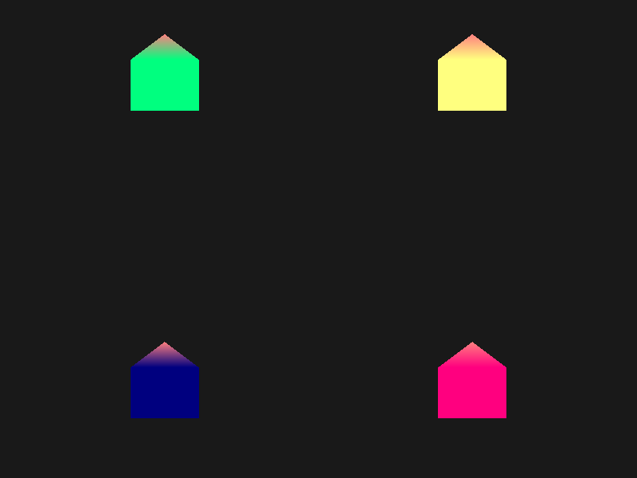
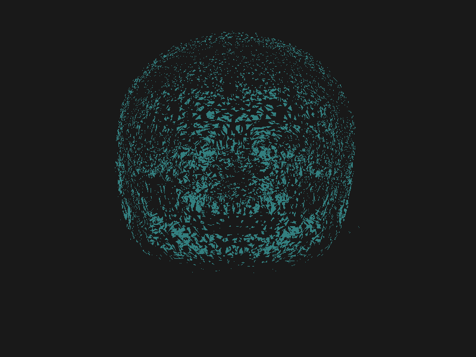
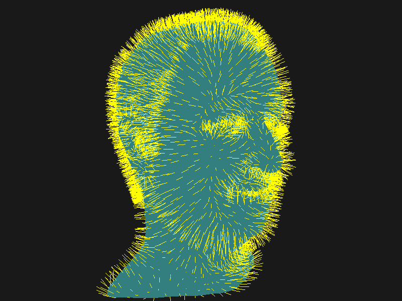
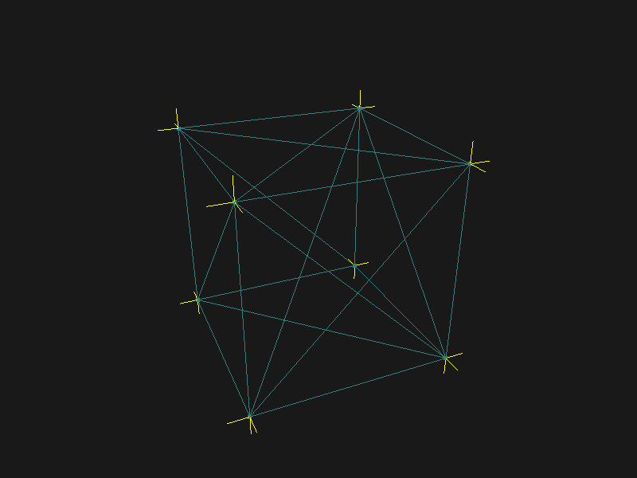

## 几何着色器

### 绘制多边形

设置输入的图元类型

```glsl
layout (points) in;
layout (line_strip, max_vertices = 2) out;
```

GLSL提供给我们一个内建(Built-in)变量，可以在geometry shader中使用`gl_in`

```glsl
in gl_Vertex
{
    vec4  gl_Position;
    float gl_PointSize;
    float gl_ClipDistance[];
} gl_in[];
```

**vertex shader**

```glsl
#version 330 core
layout(location = 0) in vec3 Position;
layout(location = 1) in vec3 Normal;
layout(location = 2) in vec2 TexCoords;

uniform mat4 model;
uniform mat4 view;
uniform mat4 projection;

out VS_OUT {
  vec2 TexCoord;
} vs_out;

void main() {
  vs_out.TexCoord = TexCoords;
  gl_Position = projection * view * model * vec4(Position, 1.0f);
  gl_PointSize = 5.0;
}
```

**geometry shader**

```glsl
#version 330 core
layout(points) in;
layout(triangle_strip, max_vertices = 5) out;

in VS_OUT {
  vec2 TexCoord;
} gs_in[];

out vec2 fColor;

void build_house(vec4 position) {

  fColor = gs_in[0].TexCoord;

  gl_Position = position + vec4(-0.2, -0.2, 0.0, 0.0);    // 1:左下
  EmitVertex();
  gl_Position = position + vec4(0.2, -0.2, 0.0, 0.0);    // 2:右下
  EmitVertex();
  gl_Position = position + vec4(-0.2, 0.2, 0.0, 0.0);    // 3:左上
  EmitVertex();
  gl_Position = position + vec4(0.2, 0.2, 0.0, 0.0);    // 4:右上
  EmitVertex();
  gl_Position = position + vec4(0.0, 0.4, 0.0, 0.0);    // 5:顶部

  fColor = vec2(1.0, 0.5); // 最后一个点的颜色

  EmitVertex();
  EndPrimitive();
}

void main() {
  build_house(gl_in[0].gl_Position);
}
```

**fragment shader**

```glsl
#version 330 core
out vec4 FragColor;

in VS_OUT {
  vec2 TexCoord;
} vs_in;

in vec2 fColor;

void main() {

  FragColor = vec4(vec3(fColor, 0.5), 1.0);
}
```



### 爆破物体

使用叉乘 cross获取垂直与其它两个向量的一个向量，使用减法获取平行于三角形表面的向量a和b

```glsl
vec3 GetNormal()
{
   vec3 a = vec3(gl_in[0].gl_Position) - vec3(gl_in[1].gl_Position);
   vec3 b = vec3(gl_in[2].gl_Position) - vec3(gl_in[1].gl_Position);
   return normalize(cross(a, b));
}
```

使位置向量沿着法向量进行位移

```glsl
vec4 explode(vec4 position, vec3 normal)
{
    float magnitude = 2.0;
    vec3 direction = normal * ((sin(time) + 1.0) / 2.0) * magnitude; 
    return position + vec4(direction, 0.0);
}
```



**参考**：https://learnopengl-cn.github.io/04%20Advanced%20OpenGL/09%20Geometry%20Shader/#_4

### 法向量可视化





## 参考

https://learnopengl-cn.github.io/04%20Advanced%20OpenGL/09%20Geometry%20Shader/
