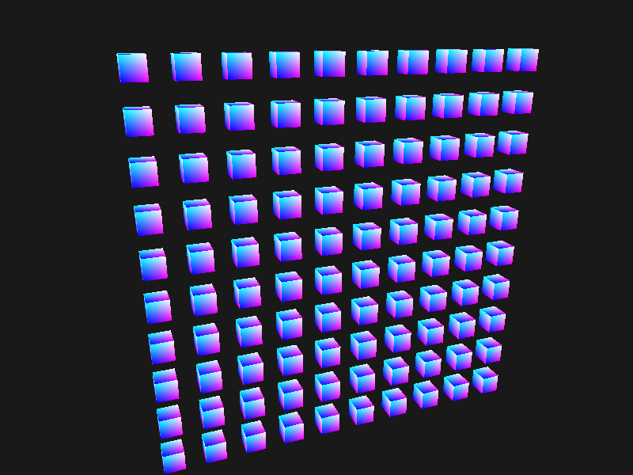
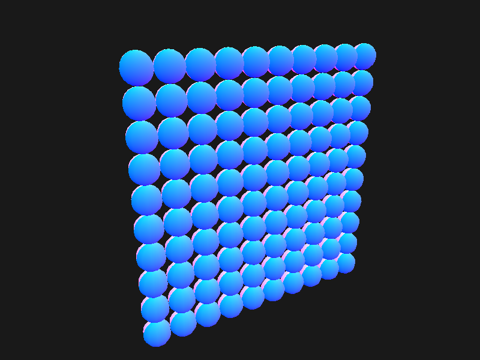
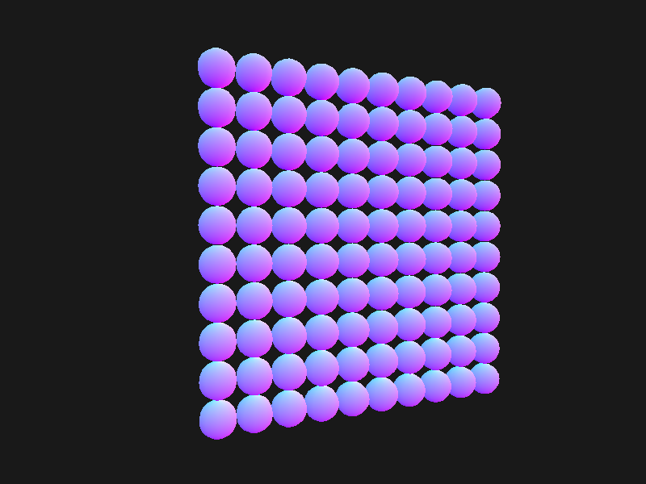

## 实例化

设置实例数据

```c++
glm::vec3 translations[100];
int index = 0;
float offset = 0.3f;
for (int y = -10; y < 10; y += 2)
{
    for (int x = -10; x < 10; x += 2)
    {
        glm::vec3 translation;
        translation.x = (float)x / 10.0f + offset;
        translation.y = (float)y / 10.0f + offset;
        translation.z = 0.0;
        translations[index++] = translation;
    }
}

sceneShader.use();
for (unsigned int i = 0; i < 100; i++)
{
    sceneShader.setVec3("offsets[" + std::to_string(i) + "]", translations[i]);
}

```

**vertex shader**

```glsl
#version 330 core
layout(location = 0) in vec3 Position;
layout(location = 1) in vec3 Normal;
layout(location = 2) in vec2 TexCoords;

uniform mat4 model;
uniform mat4 view;
uniform mat4 projection;

uniform vec3 offsets[100];

out vec2 oTexCoord;

void main() {
  oTexCoord = TexCoords;
  vec3 offset = offsets[gl_InstanceID];
  gl_Position = projection * view * model * vec4(Position + offset, 1.0f);
}
```

**render**

```c++
sceneShader.use();
sceneShader.setMat4("projection", projection);
sceneShader.setMat4("view", view);
sceneShader.setMat4("model", model);

glBindVertexArray(boxGeometry.VAO);
// 索引方式绘制
// mode 基元类型
// count 索引数组的长度
// type 索引值类型
// indices 绘制起始量
// primcount 指定要呈现的索引范围的实例数
glDrawElementsInstanced(GL_TRIANGLES, boxGeometry.indices.size(), GL_UNSIGNED_INT, 0, 100);
glBindVertexArray(0);
```








### 实例化数组

使用`uniform vec3 offsets[100];`这种方式渲染数量较小的时候比较方便，但是如果大批量数据的话，就会很快超过能够发送至着色器`uniform`的上限，替代化方案是实例化数组。

它被定义为一个顶点属性，仅在顶点着色器渲染一个新的实例时才会更新。

使用顶点属性时，顶点着色器每次运行都会让GLSL获取新一组适用于当前顶点的属性，而当我将顶点属性定义为一个实例数组时，顶点着色器就只需要对每个实例，而不是每个顶点，去更新顶点属性

- 对逐顶点的数据使用普通的顶点属性
- 对逐实例的数据使用实例化数组


## 参考

https://learnopengl-cn.github.io/04%20Advanced%20OpenGL/10%20Instancing/

