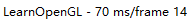
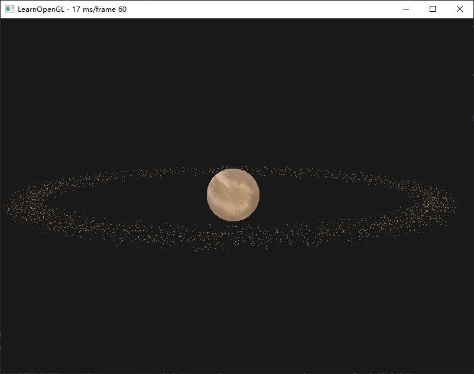
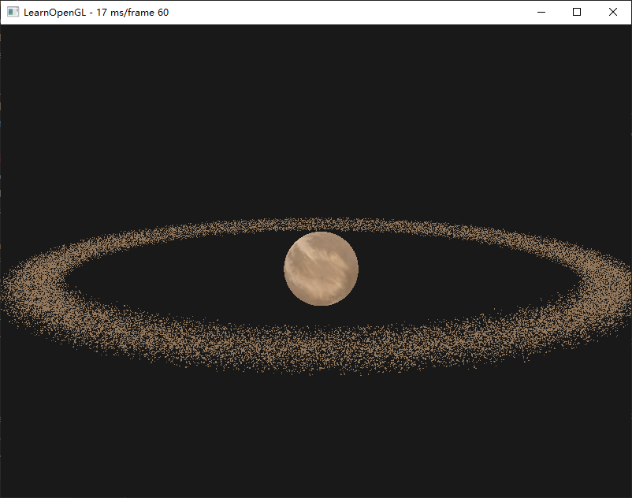

## 绘制小行星带

### 实例化数组

使用`uniform vec3 offsets[100];`这种方式渲染数量较小的时候比较方便，但是如果大批量数据的话，就会很快超过能够发送至着色器`uniform`的上限，替代化方案是实例化数组。

它被定义为一个顶点属性，仅在顶点着色器渲染一个新的实例时才会更新。

使用顶点属性时，顶点着色器每次运行都会让GLSL获取新一组适用于当前顶点的属性，而当我将顶点属性定义为一个实例数组时，顶点着色器就只需要对每个实例，而不是每个顶点，去更新顶点属性

- 对逐顶点的数据使用普通的顶点属性
- 对逐实例的数据使用实例化数组

使用一般方式绘制一万个小行星的时候帧率此是已经下降到了14




**实例数组渲染方式**

```c++
instanceShader.use();
instanceShader.setMat4("projection", projection);
instanceShader.setMat4("view", view);
instanceShader.setInt("diffuseTexture", 0);
glActiveTexture(GL_TEXTURE0);
glBindTexture(GL_TEXTURE_2D, rock.textures_loaded[0].id);
for (unsigned int i = 0; i < rock.meshes.size(); i++)
{
    glBindVertexArray(rock.meshes[i].VAO);
    glDrawElementsInstanced(GL_TRIANGLES, rock.meshes[i].indices.size(), GL_UNSIGNED_INT, 0, amount);
}
```

```glsl
#version 330 core
layout(location = 0) in vec3 Position;
layout(location = 1) in vec3 Normal;
layout(location = 2) in vec2 TexCoords;

layout(location = 3) in mat4 instanceMatrix;

uniform mat4 view;
uniform mat4 projection;

out vec2 oTexCoord;

void main() {
  oTexCoord = TexCoords;
  gl_Position = projection * view * instanceMatrix * vec4(Position, 1.0f);
}
```



渲染十万个帧率依然保持正常



## 参考

https://learnopengl-cn.github.io/04%20Advanced%20OpenGL/10%20Instancing/#_3

