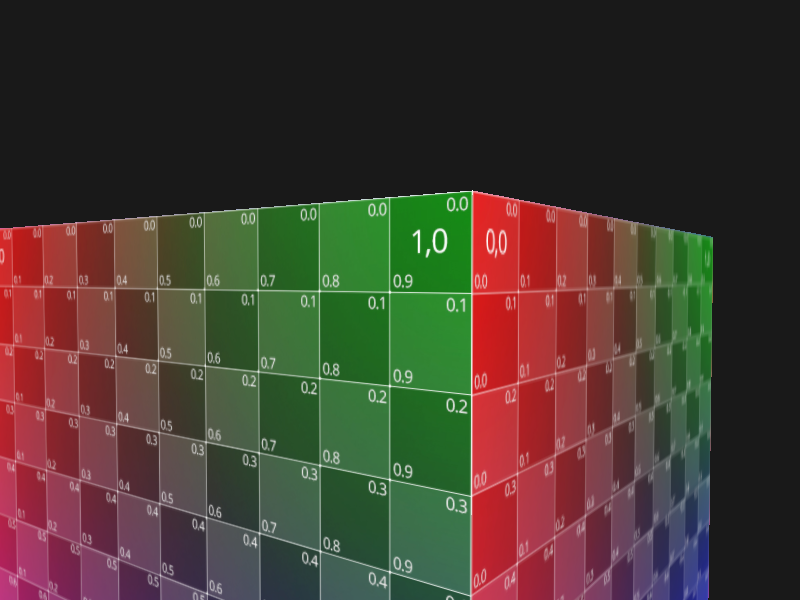
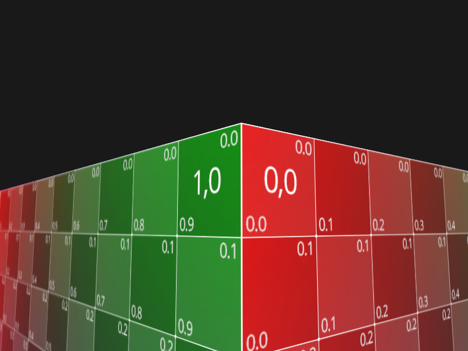

## 抗锯齿


**锯齿**



### MSAA

**启用多重采样抗锯齿**

```c++
// 片段着色器将作用域每一个采样点（采用4倍抗锯齿，则每个像素有4个片段（四个采样点））
// 采样点越多越，但是缓冲会翻倍增加
glfwWindowHint(GLFW_SAMPLES, 4);

glEnable(GL_MULTISAMPLE);
```



### 离屏MSAA


## 参考

https://learnopengl-cn.github.io/04%20Advanced%20OpenGL/11%20Anti%20Aliasing/
