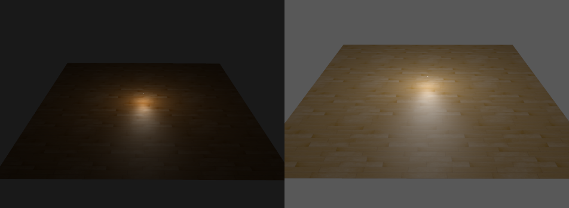
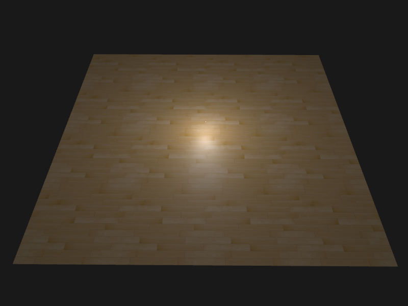
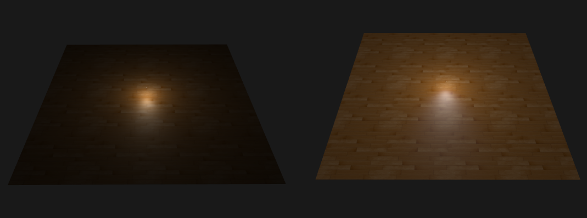

## Gamma校正


### OpenGL中启用

OpenGL中启用gamma校正的方法

```c++
glEnable(GL_FRAMEBUFFER_SRGB);
```

启用前后效果对比



启用后场景变的更亮，包括背景色也变亮

> gamma校正将线性颜色空间转变为非线性空间，所以再最后一步进行gamma校正是及其重要的，如果你在u子厚输出之前就进行gamma校正，所有后续操作都是再操作不正确的颜色值。

### 着色器中使用

```glsl
FragColor = vec4(result, 1.0);
float gamma = 2.2;
FragColor.rgb = pow(FragColor.rgb, vec3(1.0 / gamma));
```



### 纹理重校

使用gamma校正后会发现上图纹理颜色被破坏，这是因为进行了两次gamma校正，所以图片就显得很亮

把sRGB纹理变回线性空间

```glsl
float gamma = 2.2;
// 将颜色变回线性空间
vec3 color = pow(texture(woodMap, oTexCoord).rgb, vec3(gamma));

// 进行gamma校正
FragColor = vec4(result, 1.0);
FragColor.rgb = pow(FragColor.rgb, vec3(1.0 / gamma));
```

前后对比



## 参考

https://learnopengl-cn.github.io/05%20Advanced%20Lighting/02%20Gamma%20Correction/
