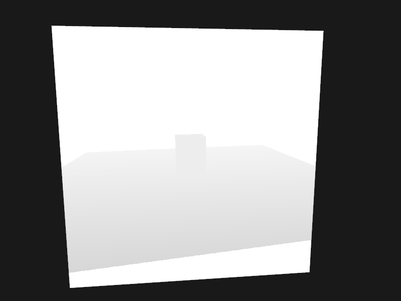

## 阴影映射

### 深度贴图

**步骤1**

创建帧缓冲

```c++
unsigned int depthMapFBO;
glGenFramebuffers(1, &depthMapFBO);
```

**步骤2**

创建2D纹理供帧缓冲的深度缓冲使用

```c++
const unsigned int SHADOW_WIDTH = 1024, SHADOW_HEIGHT = 1024;
unsigned int depthMap;
glGenTextures(1, &depthMap);
glBindTexture(GL_TEXTURE_2D, depthMap);
glTexImage2D(GL_TEXTURE_2D, 0, GL_DEPTH_COMPONENT, SHADOW_WIDTH, SHADOW_HEIGHT, 0, GL_DEPTH_COMPONENT, GL_FLOAT, NULL);
glTexParameteri(GL_TEXTURE_2D, GL_TEXTURE_MIN_FILTER, GL_NEAREST);
glTexParameteri(GL_TEXTURE_2D, GL_TEXTURE_MAG_FILTER, GL_NEAREST);
glTexParameteri(GL_TEXTURE_2D, GL_TEXTURE_WRAP_S, GL_REPEAT);
glTexParameteri(GL_TEXTURE_2D, GL_TEXTURE_WRAP_T, GL_REPEAT);
```

**步骤3**

把生成的纹理作为帧缓冲的深度缓冲

```c++
glBindFramebuffer(GL_FRAMEBUFFER, depthMapFBO);
glFramebufferTexture2D(GL_FRAMEBUFFER, GL_DEPTH_ATTACHMENT, GL_TEXTURE_2D, depthMap, 0);
glDrawBuffer(GL_NONE);
glReadBuffer(GL_NONE);
glBindFramebuffer(GL_FRAMEBUFFER, 0);
```

**步骤4**

渲染循环中

```c++
// 1.渲染深度贴图

// 2.使用深度贴图
```

```c++
glm::mat4 lightProjection, lightView;
glm::mat4 lightSpaceMatrix;
float near_plane = 1.0f, far_plane = 7.5f;
lightProjection = glm::ortho(-10.0f, 10.0f, near_plane, far_plane);
lightView = glm::lookAt(lightPosition, glm::vec3(0.0f), glm::vec3(0.0f, 1.0f, 0.0f));
// 光源空间变换
lightSpaceMatrix = lightProjection * lightView;
simpleShadowShader.use();
simpleShadowShader.setMat4("lightSpaceMatrix", lightSpaceMatrix);

glViewport(0, 0, SHADOW_WIDTH, SHADOW_HEIGHT);
glBindFramebuffer(GL_FRAMEBUFFER, depthMapFBO);
glClear(GL_DEPTH_BUFFER_BIT);
glActiveTexture(GL_TEXTURE0);

// 正常绘制场景
drawFloor(sceneShader, groundGeometry, woodMap);
drawBrick(sceneShader, boxGeometry, brickMap);
drawLightObject(lightObjectShader, pointLightGeometry);

glBindFramebuffer(GL_FRAMEBUFFER, 0);

glm::mat4 view = camera.GetViewMatrix();
glm::mat4 model = glm::mat4(1.0f);
glm::mat4 projection = glm::mat4(1.0f);
projection = glm::perspective(glm::radians(camera.Zoom), (float)SCREEN_WIDTH / (float)SCREEN_HEIGHT, 0.1f, 100.0f);

glViewport(0, 0, SCREEN_WIDTH, SCREEN_HEIGHT);
glClear(GL_COLOR_BUFFER_BIT | GL_DEPTH_BUFFER_BIT);
quadShader.use();
quadShader.setMat4("view", view);
quadShader.setMat4("model", model);
quadShader.setMat4("projection", projection);
quadShader.setFloat("near_plane", near_plane);
quadShader.setFloat("far_plane", far_plane);

glActiveTexture(GL_TEXTURE0);
glBindTexture(GL_TEXTURE_2D, depthMap);
glBindVertexArray(quadGeometry.VAO);
glDrawElements(GL_TRIANGLES, quadGeometry.indices.size(), GL_UNSIGNED_INT, 0);
glBindVertexArray(0);
```



## 参考

