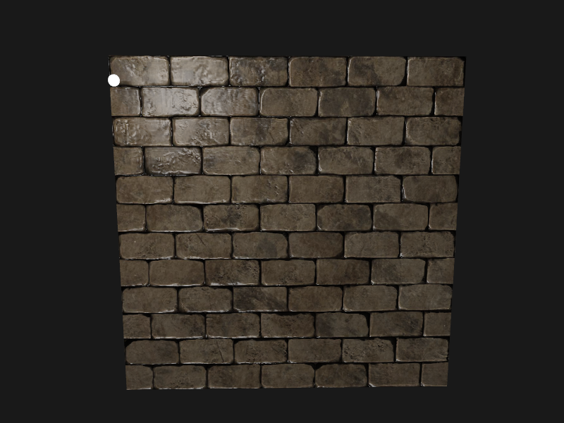
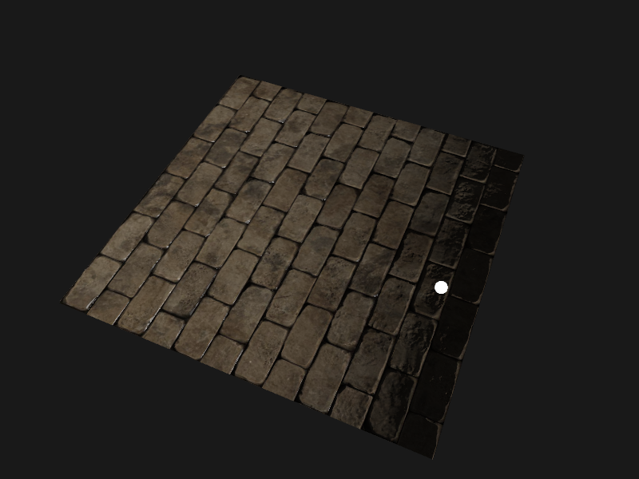
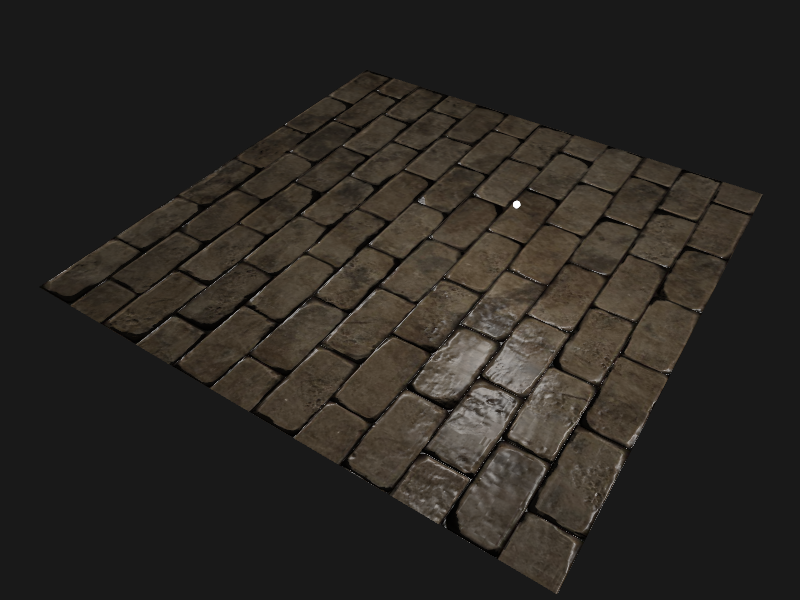

## 法线贴图

将物体沿X轴旋转90度法线，法线显示的错误

## 切线空间

由于不能保证三角形表面的法线方向一定和法线贴图的方向一致，所以需要在一个不同的坐标空间中进行光照，使得法线贴图可以正常计算

1. 这个坐标空间中，法线贴图向量总是指向这个坐标空间的正z方向。
2. 所有的光照向量都相对于这个正z方向进行变换。

这样就能始终使用同样的法线贴图，不管朝向问题，这个坐标空间叫做切线空间。

- 法线贴图中的法向量在切线空间中，法线永远指着正z方向。
- 切线空间时位于三角形表面之上的空间。
- 使用一个特定的矩阵就能将本地/切线空间中的法线向量转成世界或者视图坐标，使它们转向到最终的贴图表面的方向。

## 参考

https://learnopengl-cn.github.io/05%20Advanced%20Lighting/04%20Normal%20Mapping/#_1
