## 漫反射辐照度

**等距柱状投影到立方体贴图**

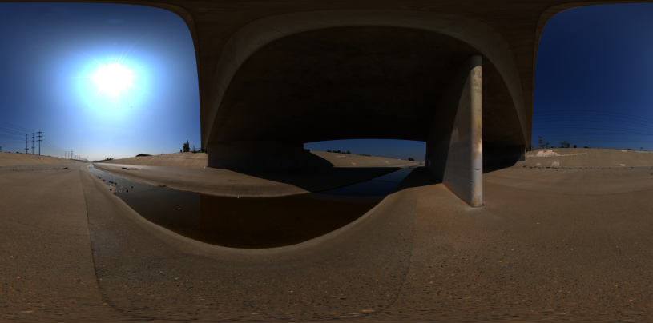

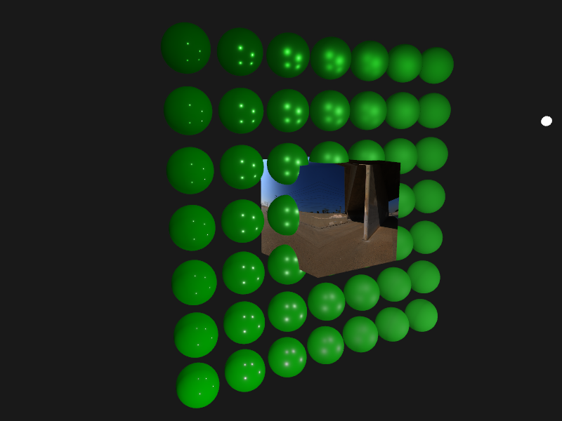

**将等距柱状图转换成立方体贴图Cubemap**

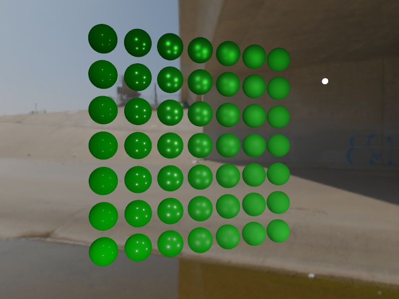

**通过卷积计算漫反射辐照度图**

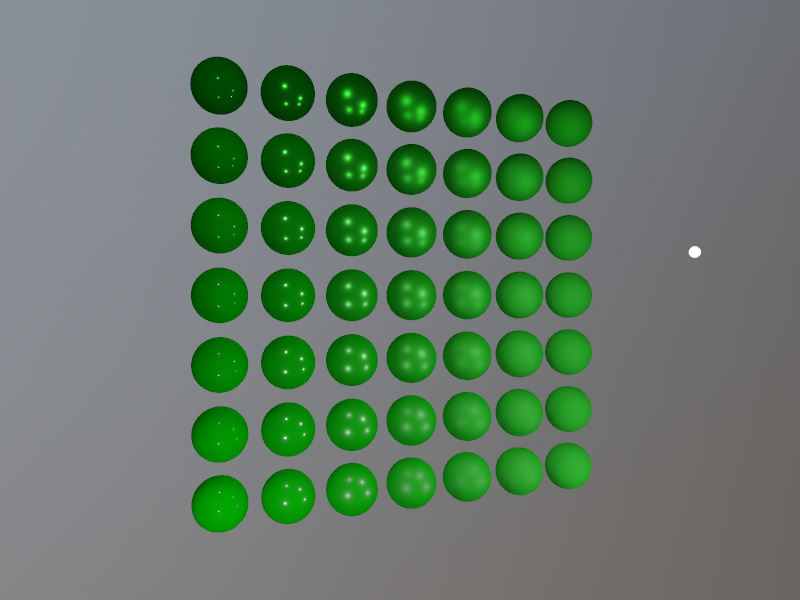

**查看漫反射辐照度图在球体商的显示**

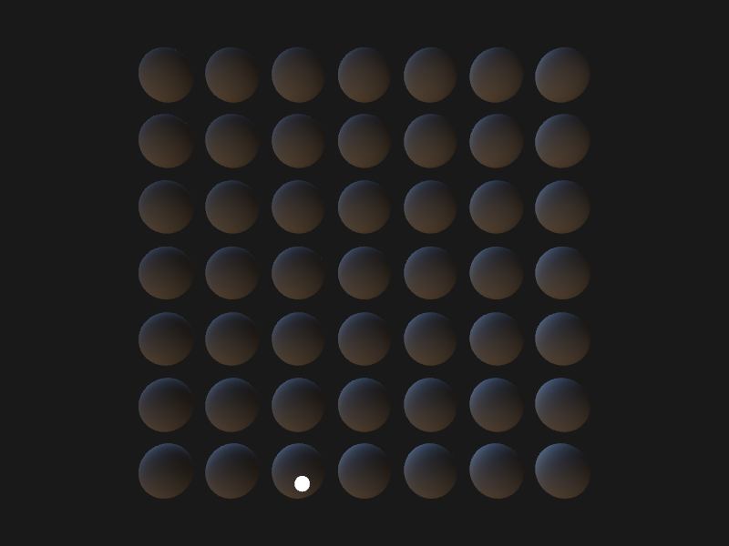

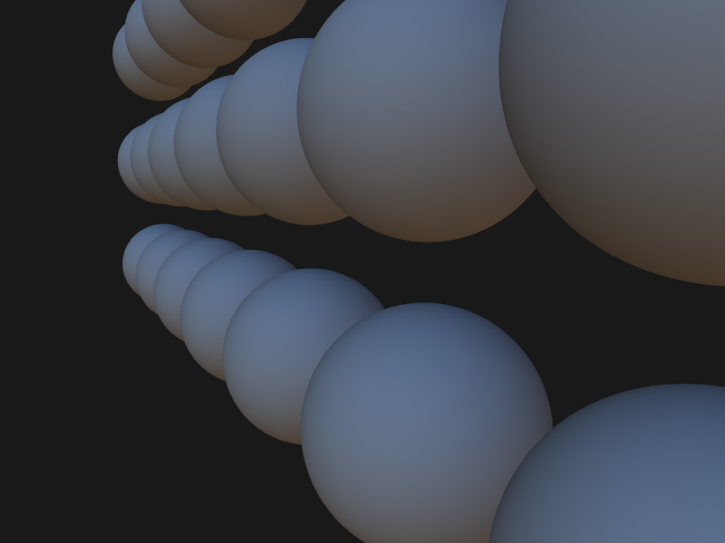

**更换一张hdr贴图测试结果**

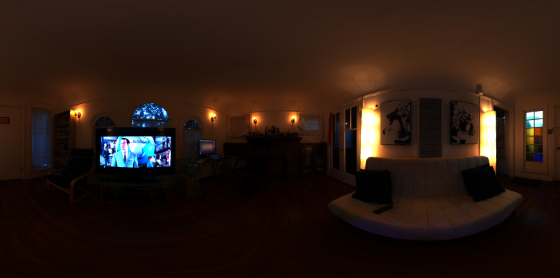

**使用辐照度图作为环境光**

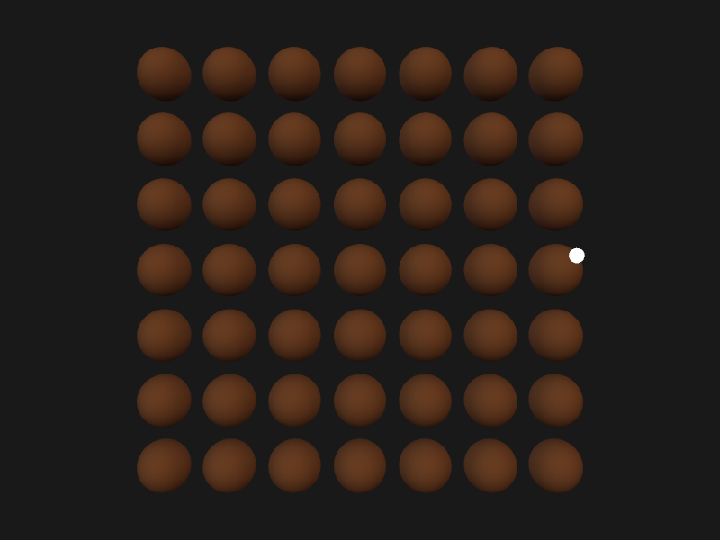

**KS菲涅尔反射项显示效果**

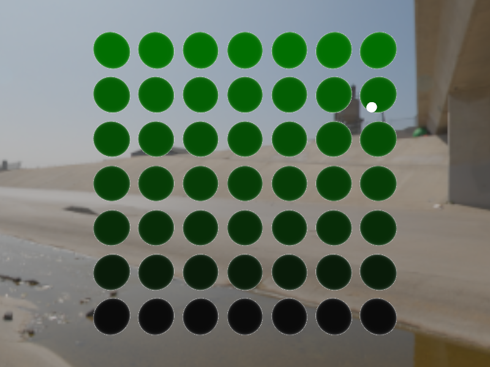

**KD入射光线中被折射部分**

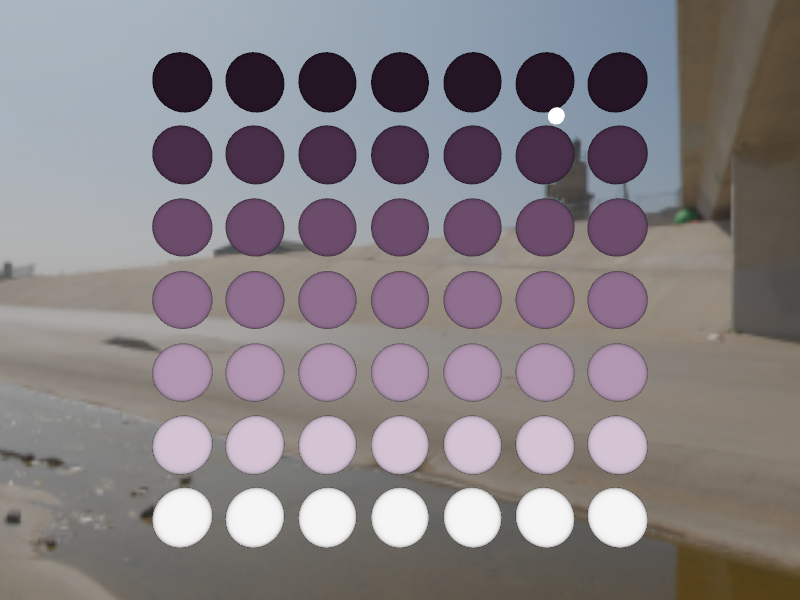

**不加辐照度图和添加后的对比**

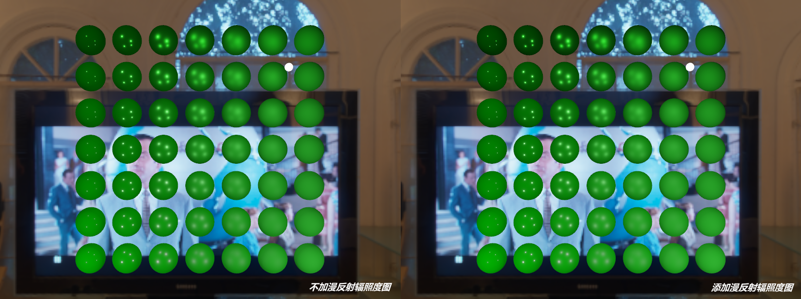

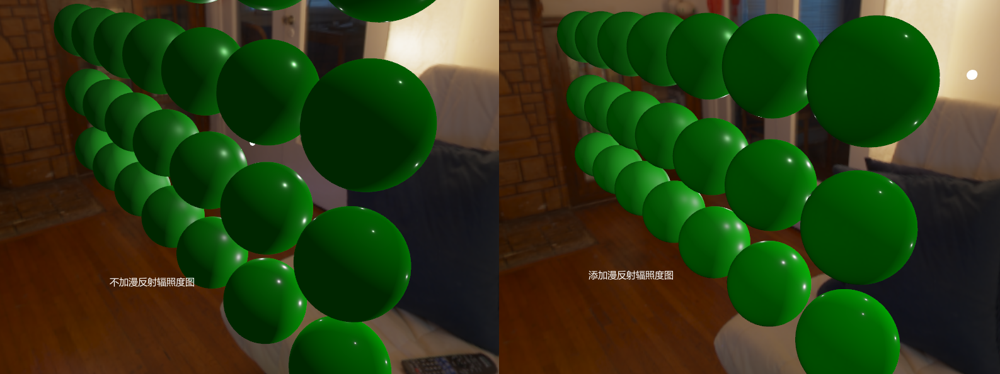

换一张hdr贴图测试

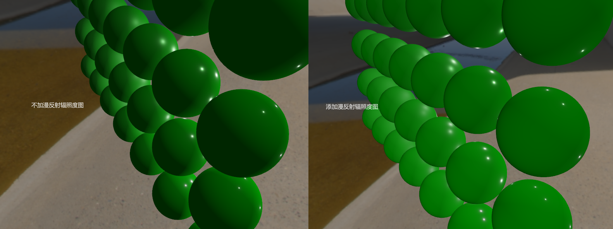

## 参考

https://learnopengl-cn.github.io/07%20PBR/03%20IBL/01%20Diffuse%20irradiance/

