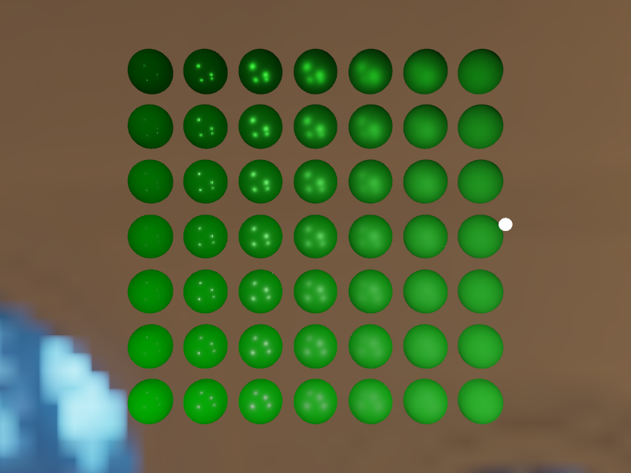
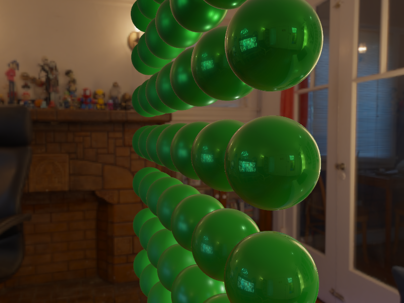

## 镜面反射 IBL

- 第一部分：预先计算的环境卷积贴图
- 第二部分：BRDF积分贴图，存储菲涅尔响应系数

**预滤波环境贴图**

**BRDF积分贴图**

存储菲涅尔以下系数，

- R：响应系数
- G：偏差值

**将预过滤贴图和BRDF组合获取IBL镜面反射**

## 参考

https://learnopengl-cn.github.io/07%20PBR/03%20IBL/02%20Specular%20IBL/#ibl
